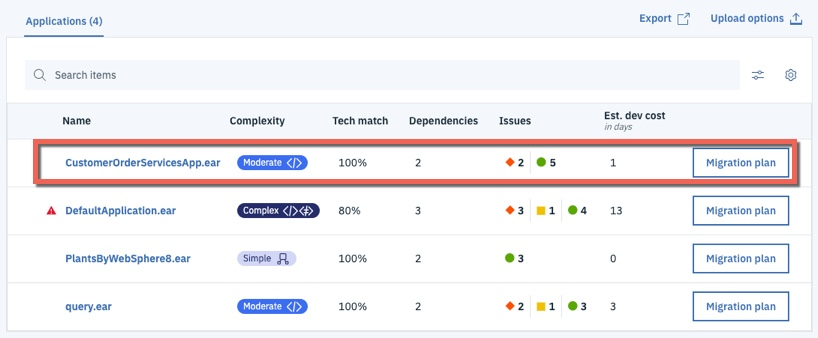
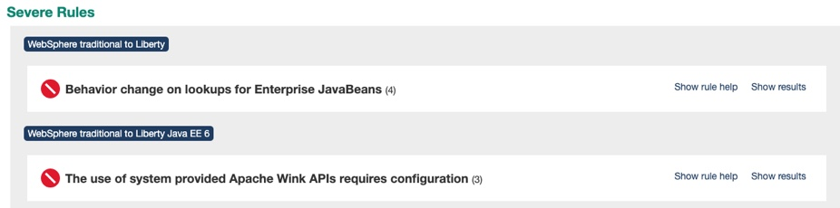

# CloudPak for Applications: Runtime Modernization Solution

## Introduction
**Runtime modernization** moves an application to a 'built for the cloud' runtime with the least amount of effort. **WebSphere Liberty** is a fast, dynamic, and easy-to-use Java application server, built on the open source Open Liberty project. Ideal or the cloud, Liberty is a combination of IBM technology and open source software, with fast startup times (<2 seconds), no server restarts to pick up changes, and a simple XML configuration.

However, WebSphere Liberty doesn't support all of the legacy Java EE and WebSphere proprietary functionality and some code changes maybe required to move an existing application to the new runtime. Effort is also required to move the application configuration from traditional WebSphere to WebSphere Liberty's XML configuration files.

**This path gets the application on to a cloud-ready runtime container which is easy to use and portable. However, the application is mostly unchanged and has not been 'modernized' to a newer architecture such as micro-services**  

Applications deployed on the WebSphere Liberty container runtime can be build, deployed and managed with the same common technologies and methodologies that would be used by cloud-native (built for the cloud) applications.

  The diagram below shows the high level decision flow where IBM Cloud Transformation Advisor is used to analyze existing assets and a decision is made to move the monolithic application to the Liberty container.

  

This repository holds a solution that is the result of a **runtime modernization** for an existing WebSphere Java EE application that was moved from WebSphere ND v8.5.5 to WebSphere Liberty and deployed by the IBM CloudPak for Applications to RedHat OpenShift.

## Table of Contents

- [Application Overview](#application-overview)
- [How the Application was Modernized](#how-the-application-was-modernized)
  - [Analysis](#analysis)
  - [Build](#build)
  - [Deploy](#deploy)
- [Deploy the Application](#deploy-the-application)
  - [Getting the project repository](#getting-the-project-repository)
  - [Create the Security Context Constraint](#create-the-security-context-constraint)
  - [Create the projects](#create-the-projects)
  - [Create a service account](#create-a-service-account)
  - [Deploy Jenkins](#deploy-jenkins)
  - [Update the Jenkins service account](update-the-jenkins-service-account)
  - [Import the deployment templates](#import-the-deployment-templates)
  - [Create the deployment definitions](#create-the-deployment-definitions)
  - [Import the build templates](#import-the-build-templates)
  - [Create the build definitions](#create-the-build-definitions)
  - [Run the pipeline](#run-the-pipeline)
- [Validate the Application](#validate-the-application)
- [Summary](#summary)

## Application Overview
The **Customer Order Services** application is a simple store-front shopping application, built during the early days of the Web 2.0 movement. Users interact directly with a browser-based interface and manage their cart to submit orders.  This application is built using the traditional [3-Tier Architecture](http://www.tonymarston.net/php-mysql/3-tier-architecture.html) model, with an HTTP server, an application server, and a supporting database.


There are several components of the overall application architecture:
- Starting with the database, the application leverages two SQL-based databases running on [IBM DB2](https://www.ibm.com/analytics/us/en/technology/db2/).
- The application exposes its data model through an [Enterprise JavaBean](https://en.wikipedia.org/wiki/Enterprise_JavaBeans) layer, named **CustomerOrderServices**.  This components leverages the [Java Persistence API](https://en.wikibooks.org/wiki/Java_Persistence/What_is_JPA%3F) to exposed the backend data model to calling services with minimal coding effort.
  - This build of the application uses JavaEE6 features for EJBs and JPA.
- The next tier of the application, named **CustomerOrderServicesWeb**, exposes the necessary business APIs via REST-based web services.  This component leverages the [JAX-RS](https://en.wikipedia.org/wiki/Java_API_for_RESTful_Web_Services) libraries for creating Java-based REST services with minimal coding effort.
  - This build of the application is using **JAX-RS 1.1** version of the respective capability.
- The application's user interface is exposed through the **CustomerOrderServicesWeb** component as well, in the form of a [Dojo Toolkit](#tbd)-based JavaScript application.  Delivering the user interface and business APIs in the same component is one major inhibitor our migration strategy will help to alleviate in the long-term.
- Finally, there is an additional integration testing component, named **CustomerOrderServicesTest** that is built to quickly validate an application's build and deployment to a given application server.  This test component contains both **JPA** and **JAX-RS**-based tests.

## How the Application was Modernized
In order to modernize the application from WebSphere ND v8.5.5 to WebSphere Liberty running on OpenShift, the application went through **analysis**, **build** and **deploy** phases.

### Analysis
[IBM Cloud Transformation Advisor](https://www.ibm.com/cloud/garage/practices/learn/ibm-transformation-advisor) was used to analyze the existing Customer Order Services application and the WebSphere ND runtime. The steps were:

1. Install IBM Cloud Transformation Advisor either in to a [Kubernetes Cluster](https://developer.ibm.com/recipes/tutorials/deploying-transformation-advisor-into-ibm-cloud-private/) or [locally](https://www.ibm.com/cloud/garage/tutorials/install-ibm-transformation-advisor-local)

2. Download and execute the **Data Collector** against the existing WebSphere ND runtime

3. Upload the results of the data collection in to IBM Cloud Transformation Advisor and review the analysis. A screenshot of the analysis is shown below:

  

  In the case of the **CustomerOrderServicesApp.ear** application, IBM Cloud Transformation Advisor has determined that the migration to WebSphere Liberty on Private Cloud is of **Moderate** complexity and that there are two **Severe Issues** that have been detected.

4. Drilling down in to **Detailed Migration Analysis Report** that is part of the application analysis, it is apparent that IBM Cloud Transformation Advisor has detected that there are issues with lookups for Enterprise JavaBeans and with accessing the Apache Wink APIs.

  

  **Behavior change on lookups for Enterprise JavaBeans** In Liberty, EJB components are not bound to a server root Java Naming and Directory Interface (JNDI) namespace as they are in WebSphere Application Server traditional. The fix for this is to change the three classes that use `ejblocal` to use the correct URL for Liberty

  **The user of system provided Apache Wink APIs requires configuration** To use system-provided third-party APIs in Liberty applications, you must configure the applications to include the APIs. In WebSphere Application Server traditional, these APIs are available without configuration. This is a configuration only change and can be achieved by using a `classloader` definition in the Liberty server.xml file.

5. In summary, some minimal code changes are required to move this application to the WebSphere Liberty runtime and the decision was taken to proceed with these code changes.

Detailed, step-by-step instructions on how to replicate these steps are provided [here](liberty-analyze.md)

### Build
The **build** phase made changes to source code and created the WebSphere Liberty configuration artifacts. The steps were:

1. Make the simple code changes required for the EJB lookups which were recommended by IBM Cloud Transformation Advisor. The three Java classes that should be modified to look up Enterprise JavaBeans differently are shown in the detailed analysis view of IBM Cloud Transformation Advisor:

  

  Below is an example of the code changes required for one of the three Java classes. The `org.pwte.example.resources.CategoryResource.java` is changed from using `ejblocal` on line 28 as shown below:

  Before:

  ```java
  ...
  InitialContext().lookup("ejblocal:org.pwte.example.service.ProductSearchService");
  ...
  ```

  After:

  ```java
  ...
  InitialContext().lookup("java:app/CustomerOrderServices/ProductSearchServiceImpl!org.pwte.example.service.ProductSearchService");
  ...
  ```

2. The WebSphere Liberty runtime configuration files `server.xml`, `server.env` and `jvm.options` were created from the templates provided by IBM Cloud Transformation Advisor. The final versions of files can be found here:

- [server.xml](https://github.com/ibm-cloud-architecture/cloudpak-for-applications/blob/liberty/liberty/server.xml)
- [server.env](https://github.com/ibm-cloud-architecture/cloudpak-for-applications/blob/liberty/liberty/server.env)
- [jvm.options](https://github.com/ibm-cloud-architecture/cloudpak-for-applications/blob/liberty/liberty/jvm.options)

3. WebSphere Liberty was configured for application monitoring using Prometheus and the Prometheus JMX Exporter. This was necessary to integrate WebSphere Liberty with the RedHat OpenShift monitoring framework.

4. The `Dockerfile` required to build the **immutable Docker Image** containing the application and WebSphere Liberty was created from the template provided by IBM Cloud Transformation Advisor. The final file can be found here:

- [Dockerfile](https://github.com/ibm-cloud-architecture/cloudpak-for-applications/blob/liberty/Dockerfile)

5. The containerized application was tested locally before the code and configuration files were committed to the **git** repository

Detailed, step-by-step instructions on how to replicate these steps are provided [here](liberty-build.md)

### Deploy
The **deploy** phase created the Jenkins, Kubernetes and RedHat OpenShift artifacts required to automate the build and deployment pipeline for the application. For illustration purposes, the application was deployed to three different RedHat OpenShift projects to simulate `development`, `staging` and `production`. The diagram below shows the flow through the pipeline. A more detailed description can be found [here]((liberty-deploy.md))

  

The steps were:

1. Configure the RedHat OpenShift Cluster for WebSphere by creating the necessary `SecurityContextConstraints` definition. The file can be found here:

- [scc.yaml](https://github.com/ibm-cloud-architecture/cloudpak-for-applications/blob/liberty/Deployment/OpenShift/ssc.yaml)

2. Create the RedHat OpenShift **build template** that would be used to define the RedHat OpenShift artifacts related to the build process including `ImageStream` and `BuildConfig` definitions. The file can be found here:

- [template-libery-build.yaml](https://github.com/ibm-cloud-architecture/cloudpak-for-applications/blob/liberty/Deployment/OpenShift/template-liberty-build.yaml)

3. Create the RedHat OpenShift **deployment template** that would be used to define the RedHat OpenShift artifacts related to the Customer Order Services application including `DeploymentConfig`, `Service` and `Route` definitions. The file can be found here:

- [template-libery-deploy.yaml](https://github.com/ibm-cloud-architecture/cloudpak-for-applications/blob/liberty/Deployment/OpenShift/template-liberty-deploy.yaml)

4. Create the Jenkins `Jenkinsfile` for the pipeline. The Jenkinsfile defines the steps that the pipeline takes to build the Customer Order Services application EAR file, create an immutable Docker Image and then move the image through the `dev`, `stage` and `prod` environments. The file can be found here:

- [Jenkinsfile](https://github.com/ibm-cloud-architecture/cloudpak-for-applications/blob/liberty/Jenkinsfile)

5. Create the `build` project, load the **build template** and configure **Jenkins**

6. Create the `dev`, `stage` and `prod` projects and load the **deployment template**

7. Verify the pipeline.

Detailed, step-by-step instructions on how to replicate these steps are provided [here](liberty-deploy.md)

## Deploy the Application
The following steps will deploy the modernized Customer Order Services application in a WebSphere Liberty container to a RedHat OpenShift cluster.

### Prerequisites
You will need the following:

- [Git CLI](https://git-scm.com/book/en/v2/Getting-Started-Installing-Git)
- RedHat OpenShift 3.11 with Cluster Admin permissions
- [oc CLI](https://docs.openshift.com/container-platform/3.11/cli_reference/get_started_cli.html)
- DB2 Database

### Getting the project repository
You can clone the repository from its main GitHub repository page and checkout the appropriate branch for this version of the application.

```
git clone https://github.com/ibm-cloud-architecture/cloudpak-for-applications.git
cd cloudpak-for-applications
git checkout liberty
```

### Create application database infrastructure
As said in the prerequisites section above, the Customer Order Services application uses uses DB2 as its database. Follow these steps to create the appropriate database, tables and data the application needs to:

1. Copy the createOrderDB.sql and initialDataSet.sql files you can find in the Common directory of this repository over to the db2 host machine (or git clone the repository) in order to execute them later.

2. Ssh into the db2 host

3. Change to the db2 instance user: `su {database_instance_name}``

4. Start db2: `db2start`

4. Create the ORDERDB database: `db2 create database ORDERDB`

5. Connect to the ORDERDB database: `db2 connect to ORDERDB`

6. Execute the createOrderDB.sql script you copied over in step 1 in order to create the appropriate tables, relationships, primary keys, etc: `db2 -tf createOrderDB.sql`

7. Execute the initialDataSet.sql script you copied over in step 1 to populate the ORDERDB database with the needed initial data set: `db2 -tf initialDataSet.sql`

If you want to re-run the scripts, please make sure you drop the databases and create them again.

### Create the Security Context Constraint
In order to deploy and run the WebSphere Liberty Docker image in an OpenShift cluster, we first need to configure certain security aspects for the cluster. The `Security Context Constraint` provided [here](https://github.com/ibm-cloud-architecture/cloudpak-for-applications/blob/liberty/Deployment/OpenShift/ssc.yaml) grants the [service account](https://kubernetes.io/docs/tasks/configure-pod-container/configure-service-account/) that the WebSphere Liberty Docker container is running under the required privileges to function correctly.

A **cluster administrator** can use the file provided [here](https://github.com/ibm-cloud-architecture/cloudpak-for-applications/blob/liberty/Deployment/OpenShift/ssc.yaml) with the following command to create the Security Context Constraint (SCC):

```
cd Deployment/OpenShift
oc apply -f ssc.yaml
```

### Create the projects
Four RedHat OpenShift projects are required in this scenario:
- Build: this project will contain the Jenkins server and the artifacts used to build the application image  
- Dev: this is the `development` environment for this application
- Stage: this is the `staging` environment for this application
- Prod: this is the `production` environment for this application

The file provided [here](https://github.com/ibm-cloud-architecture/cloudpak-for-applications/blob/liberty/Deployment/OpenShift/liberty-projects.yaml) contains the definitions for the four projects in a single file to make creation easier

Issue the command shown below to create the projects
```
oc create -f liberty-projects.yaml
```

### Create a service account
It is a good Kubernetes practice to create a [service account](https://kubernetes.io/docs/tasks/configure-pod-container/configure-service-account/) for your applications. A service account provides an identity for processes that run in a Pod. In this step we will create a new service account with the name `websphere` in each of the `dev`, `stage` and `prod` projects and add the Security Context Constraint created above to them.

Issue the commands shown below to create the `websphere` service account and bind the ibm-websphere-scc to it in each of the projects:
```
oc create serviceaccount websphere -n cos-liberty-dev
oc create serviceaccount websphere -n cos-liberty-stage
oc create serviceaccount websphere -n cos-liberty-prod
oc adm policy add-scc-to-user ibm-websphere-scc -z websphere -n cos-liberty-dev
oc adm policy add-scc-to-user ibm-websphere-scc -z websphere -n cos-liberty-stage
oc adm policy add-scc-to-user ibm-websphere-scc -z websphere -n cos-liberty-prod
```

### Deploy Jenkins
Some RedHat OpenShift clusters are configured to automatically provision a Jenkins instance in a build project. The steps below can be used if your cluster is not configured for automatic Jenkins provisioning:

```
oc project cos-liberty-build
oc new-app jenkins-persistent
```

## Update the Jenkins service account
During provisioning of the Jenkins master a service account with the name `jenkins` is created. This service account has privileges to create new artifacts only in the project that it is running in. In this scenario Jenkins will need to create artifacts in the `dev`, `stage` and `prod` projects.

Issue the commands below to allow the `jenkins` service account to `edit` artifacts in the `dev`, `stage` and `prod` projects.

```
oc policy add-role-to-user edit system:serviceaccount:cos-liberty-build:jenkins -n cos-liberty-dev
oc policy add-role-to-user edit system:serviceaccount:cos-liberty-build:jenkins -n cos-liberty-stage
oc policy add-role-to-user edit system:serviceaccount:cos-liberty-build:jenkins -n cos-liberty-prod
```

### Import the deployment templates
RedHat OpenShift [templates](https://docs.openshift.com/container-platform/3.11/dev_guide/templates.html) are used to make artifact creation easier and repeatable. The template definition provided [here](https://github.com/ibm-cloud-architecture/cloudpak-for-applications/blob/liberty/Deployment/OpenShift/template-liberty-deploy.yaml) defines a Kubernetes [`Service`](https://kubernetes.io/docs/concepts/services-networking/service/), [`Route`](https://docs.openshift.com/container-platform/3.11/architecture/networking/routes.html) and [`DeploymentConfig`](https://docs.openshift.com/container-platform/3.11/architecture/core_concepts/deployments.html#deployments-and-deployment-configurations) for the CustomerOrderServices application.

The `gse-liberty-deploy` template defines the following:
- `service` listening on ports `9080`, `9443` and `9082`
- `route` to expose the `9443` port externally
- `DeploymentConfig` to host the WebSphere Liberty container.
  - The `image` for the container is taken from the [`ImageStream`](https://docs.openshift.com/container-platform/3.11/dev_guide/managing_images.html) that will be populated by the Jenkins pipeline.
  - `environment variables` are defined for the DB2 database used by the application allowing for environment specific information to be injected
  - [Probes](https://kubernetes.io/docs/tasks/configure-pod-container/configure-liveness-readiness-probes/) for `liveness` and `readiness` are defined to check port 9443 is active
  - The `securityContext` is set to allow read/write access to the filesystem and to run the container as `user 1001`
  - The deployment will be updated if a new image is loaded to the `ImageStream` or if a change to the configuration is detected.

Issue the commands below to load the template named `gse-liberty-deploy` in the `dev`, `stage` and `prod` projects.

```
oc create -f template-liberty-deploy.yaml -n cos-liberty-dev
oc create -f template-liberty-deploy.yaml -n cos-liberty-stage
oc create -f template-liberty-deploy.yaml -n cos-liberty-prod
```

### Create the deployment definitions
In this step the `gse-liberty-deploy` template will be used to create a RedHat OpenShift [application](https://docs.openshift.com/container-platform/3.11/dev_guide/application_lifecycle/new_app.html) named `cos-liberty` in the `dev`, `stage` and `prod` namespaces.

The result will be:
- `service` listening on ports `9080`, `9443` and `9082`
- `route` to expose the `9443` port externally
- `DeploymentConfig` to host the WebSphere Liberty container. The deployment config will wait for a `docker image` to be loaded in to the `ImageStream` by the Jenkins pipeline.

Issue the following commands to create the applications from the template:

```
oc new-app gse-liberty-deploy -p APPLICATION_NAME=cos-liberty -p DB2_HOST=<your DB2 host> -p DB2_PORT=<your DB2 host> -p DB2_USER=<your DB2 user> -p DB2_PASSWORD=<your DB2 password> -n cos-liberty-dev
oc new-app gse-liberty-deploy -p APPLICATION_NAME=cos-liberty -p DB2_HOST=<your DB2 host> -p DB2_PORT=<your DB2 host> -p DB2_USER=<your DB2 user> -p DB2_PASSWORD=<your DB2 password> -n cos-liberty-stage
oc new-app gse-liberty-deploy -p APPLICATION_NAME=cos-liberty -p DB2_HOST=<your DB2 host> -p DB2_PORT=<your DB2 host> -p DB2_USER=<your DB2 user> -p DB2_PASSWORD=<your DB2 password> -n cos-liberty-prod
```

### Import the build templates
In this step a template for the `build` process will be loaded in to the `build` project. The template provided [here](https://github.com/ibm-cloud-architecture/cloudpak-for-applications/blob/liberty/Deployment/OpenShift/template-liberty-build.yaml) defines the following artifacts:

- An [ImageStream](https://docs.openshift.com/container-platform/3.11/dev_guide/managing_images.html) for the application image. This will be populated by the Jenkins Pipeline
- An ImageStream for WebSphere Liberty which will pull down the latest version of the `ibmcom/websphere-liberty:kernel-ubi-min` image and will monitor DockerHub for any updates.
- A `binary` [BuildConfig](https://docs.openshift.com/container-platform/3.11/dev_guide/builds/build_strategies.html) that will be used by the Jenkins Pipeline to build the application Docker image
- A `jenkinsfile` BuildConfig that defines the `Pipeline` using the `Jenkinsfile` in GitHub
- Parameters to allow the WebSphere Liberty image and GitHub repository to be provided when the template is instantiated

Issue the commands below to load the template named `gse-liberty-build` in the `build` projects.

```
oc create -f template-liberty-build.yaml -n cos-liberty-build
```

### Create the build definitions
In this step the `gse-liberty-build` template will be used to create a RedHat OpenShift [application](https://docs.openshift.com/container-platform/3.11/dev_guide/application_lifecycle/new_app.html) named `cos-liberty` in the `build` namespaces.

The result will be:
- An [ImageStream](https://docs.openshift.com/container-platform/3.11/dev_guide/managing_images.html) for the application image. This will be populated by the Jenkins Pipeline
- An ImageStream for WebSphere Liberty which will pull down the latest version of the `ibmcom/websphere-liberty:kernel-ubi-min` image and will monitor DockerHub for any updates.
- A `binary` [BuildConfig](https://docs.openshift.com/container-platform/3.11/dev_guide/builds/build_strategies.html) that will be used by the Jenkins Pipeline to build the application Docker image
- A `jenkinsfile` BuildConfig that defines the `Pipeline` using the `Jenkinsfile` in GitHub (with the URL provided as a parameter when the application is created)

Issue the following commands to create the application from the template:

```
oc new-app gse-liberty-build -p APPLICATION_NAME=cos-liberty -p SOURCE_URL="https://github.com/ibm-cloud-architecture/cloudpak-for-applications" -n cos-liberty-build
```

### Run the pipeline  
The newly created pipeline can be started from the RedHat OpenShift console which allows access to the Jenkins logs but also tracks the progress in the OCP console.

1. Navigate to **Application Console --> Customer Order Services on Liberty - Build --> Builds --> Pipelines** and click the **Start Pipeline** button

  

2. When the pipeline starts, click the `view log` link to go to the Jenkins administration console. Note that it may take a couple of minutes before the `view log` link appears on the first pipeline build

  

3. When prompted, log in with your OpenShift account and grant the required access permissions. The Jenkins console log will be displayed as shown below:

  

4. Return to the OpenShift Console and track the progress of the pipeline

  

5. The pipeline will eventually stop at the **Promotion Gate** for approval to deploy to Production. Click the **Input Required** link as shown below

  

6. When the *Promote application to Production* question is displayed, click **Proceed**

  

7. Return to the OpenShift Console and validate that the pipeline is now complete

  

## Validate the Application
Now that the pipeline is complete, validate the Customer Order Services application is deployed and running in `dev`, `stage` and `prod`

1. In the OpenShift Console, navigate to **Application Console --> Customer Order Services on Liberty - Dev --> Applications --> Deployments** and click on the link in the **Latest Version** column

  

2. Information about the deployment will be displayed including the **image** that is being used (note the **tag** on the image as it will be the same in the `stage` and `prod` deployments). After a few minutes the container will be marked as **ready**

  

3. Click **Applications --> Routes** and click on the **route** for the application. Note that the URL is < application_name >-< project_name >.< ocp cluster url >. In this case the project name is `cos-liberty-dev`

  

4. Add `/CustomerOrderServicesWeb` to the end of the URL in the browser to access the application

  

5. Log in to the application with `username: rbarcia` and `password: bl0wfish`

6. Repeat the validations for the `stage` and `prod` Projects.

## Summary
This application has been modified from the initial [WebSphere ND v8.5.5 version](https://github.com/ibm-cloud-architecture/cloudpak-for-applications/tree/was855) to run on WebSphere Liberty and deployed by the IBM CloudPak for Applications.
