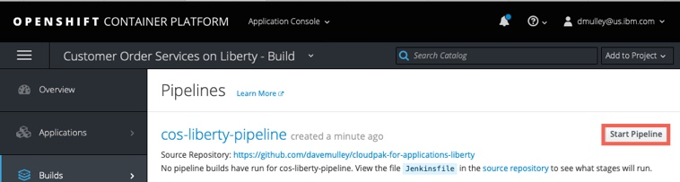
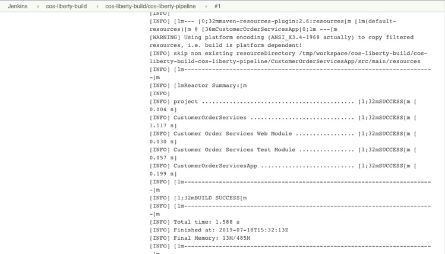

# Spring Modernization

**Spring modernization** gives operations team the opportunity to embrace modern operations best practices without putting change requirements on the development team. Modernizing from plain, on-premise Spring Boot application to the SpringBoot application running on the OpenLiberty runtime in a container allows the application to be moved to the cloud without code changes and yet have option to have support from IBM and other benefits.

This type of modernization should not require any code changes and can be driven by the operations team. This path gets the application in to a container with the least amount of effort but doesn't modernize the application or the runtime.

Let's talk about **why** we want would want to deploy our applications on Liberty instead of using native SpringBoot which under the covers deploys on Tomcat.  
- Performance. Benchmarks have shows that Liberty perform better than Tomcat on both throughput and response time.

- Size.  The memory footprint of Liberty is smaller than tomcat, but more importantly the Spring boot libraries can be separated from the runtime libraries. When we look at the way Docker builds it's images using layers, the application portion is much smaller if we build out images in the optimized way.  This means faster build time, and if you're storing every version of your application you build, the delta between versions is much smaller

- Support. If you're running on Openshift using IBM Cloud Paks, using the Liberty runtime is included in your licensing model, so using Liberty comes at no additional cost, but if need any support for Liberty it's included.  If you stick with standard springboot with tomcat, you'll have to either run on an unsupported platform, or pay for additional support for the tomcat runtime.

-  Consistent runtime model.  Running Liberty has many best practices especially in the Kubernetes/Openshift world.  There are built in metrics and monitoring tools which are specifically designed to be integrated into OpenShift.  Using Liberty allows you to leverage many if these automatic connections to better maintain your environment.

**Ok** enough with the Marketing stuff, let's talk about how to actually do this.

[Get Code](https://github.com/ibm-cloud-architecture/cloudpak-for-applications/tree/spring)

Check out the code above.

## Table of Contents

- [Application Overview](#application-overview)
- [How the Application was Modernized](#how-the-application-was-modernized)
  - [Code Changes](#code-changes)
  - [Build](#build)
  - [Deploy](#deploy)
- [Deploy the Application](#deploy-the-application)
  - [Getting the project repository](#getting-the-project-repository)
  - [Create the Security Context Constraint](#create-the-security-context-constraint)
  - [Create the projects](#create-the-projects)
  - [Create a service account](#create-a-service-account)
  - [Deploy Jenkins](#deploy-jenkins)
  - [Update the Jenkins service account](update-the-jenkins-service-account)
  - [Import the deployment templates](#import-the-deployment-templates)
  - [Create the deployment definitions](#create-the-deployment-definitions)
  - [Import the build templates](#import-the-build-templates)
  - [Create the build definitions](#create-the-build-definitions)
  - [Run the pipeline](#run-the-pipeline)
- [Validate the Application](#validate-the-application)
- [Summary](#summary)

## Application Overview
Pet Clinic is a demonstration application that was created in 2003 to show the features and functions of the Spring Framework. A description of the original application can be found in the **The Pet Clinic Application** section of the [readme](https://projects.spring.io/spring-petclinic/#quick-start)

## How the Application was Modernized
In order to modernize the application from the Spring Framework to Spring Boot and WebSphere Liberty running on OpenShift, the application went through **code changes**, **build** and **deploy** phases.

### Code Changes
Pet Clinic was modernized by the open source community in 2013 from Spring Framework 2.5 to Spring Framework 3.0 and then in 2016 to Spring Boot. The process of making the code changes is outside of the scope of this document, however the general modernization process is described below:

- [Spring Framework Upgrades](https://github.com/spring-projects/spring-framework/wiki/Upgrading-to-Spring-Framework-5.x)
- [Spring Boot Upgrades](https://github.com/spring-projects/spring-boot/wiki/Spring-Boot-2.0-Migration-Guide)
- [Spring Framework to Spring Boot](https://www.baeldung.com/spring-boot-migration)

### Build
The **build** phase created the Dockerfile for the application. The steps were:

1. The `Dockerfile` required to build the **immutable Docker Image** containing the application and WebSphere Liberty was created using the `openliberty/open-liberty:springBoot2-ubi-min` image.

  ```
  FROM openliberty/open-liberty:springBoot2-ubi-min
  COPY --chown=1001:0 spring-petclinic/target/spring-petclinic-2.1.0.BUILD-SNAPSHOT.jar /config/dropins/spring/
  ```

  The final file can be found here:

  - [Dockerfile](https://github.com/ibm-cloud-architecture/cloudpak-for-applications/blob/spring/Dockerfile)

2. The containerized application was tested locally before the code and configuration files were committed to the **git** repository

Detailed, step-by-step instructions on how to replicate these steps are provided [here](liberty-build.md) XXXXXXXX

### Deploy
The **deploy** phase created the Jenkins, Kubernetes and Red Hat OpenShift artifacts required to automate the build and deployment pipeline for the application. For illustration purposes, the application was deployed to three different Red Hat OpenShift projects to simulate `development`, `staging` and `production`. The diagram below shows the flow through the pipeline. A more detailed description can be found [here](liberty-deploy.md)

  

The steps were:

1. Configure the Red Hat OpenShift Cluster for WebSphere by creating the necessary `SecurityContextConstraints` definition. The file can be found here:

- [scc.yaml](https://github.com/ibm-cloud-architecture/cloudpak-for-applications/blob/liberty/Deployment/OpenShift/ssc.yaml)

2. Create the Red Hat OpenShift **build template** that would be used to define the Red Hat OpenShift artifacts related to the build process including `ImageStream` and `BuildConfig` definitions. The file can be found here:

- [template-libery-build.yaml](https://github.com/ibm-cloud-architecture/cloudpak-for-applications/blob/liberty/Deployment/OpenShift/template-liberty-build.yaml)

3. Create the Red Hat OpenShift **deployment template** that would be used to define the Red Hat OpenShift artifacts related to the Pet Clinic application including `DeploymentConfig`, `Service` and `Route` definitions. The file can be found here:

- [template-libery-deploy.yaml](https://github.com/ibm-cloud-architecture/cloudpak-for-applications/blob/liberty/Deployment/OpenShift/template-liberty-deploy.yaml)

4. Create the Jenkins `Jenkinsfile` for the pipeline. The Jenkinsfile defines the steps that the pipeline takes to build the Pet Clinic application, create an immutable Docker Image and then move the image through the `dev`, `stage` and `prod` environments. The file can be found here:

- [Jenkinsfile](https://github.com/ibm-cloud-architecture/cloudpak-for-applications/blob/liberty/Jenkinsfile)

5. Create the `build` project, load the **build template** and configure **Jenkins**

6. Create the `dev`, `stage` and `prod` projects and load the **deployment template**

7. Verify the pipeline.

Detailed, step-by-step instructions on how to replicate these steps are provided [here](liberty-deploy.md)

## Deploy the Application
The following steps will deploy the modernized Pet Clinic application in a WebSphere Liberty container to a Red Hat OpenShift cluster.

### Prerequisites
You will need the following:

- [Git CLI](https://git-scm.com/book/en/v2/Getting-Started-Installing-Git)
- Red Hat OpenShift 3.11 with Cluster Admin permissions
- [oc CLI](https://docs.openshift.com/container-platform/3.11/cli_reference/get_started_cli.html)
- DB2 Database

### Getting the project repository
You can clone the repository from its main GitHub repository page and checkout the appropriate branch for this version of the application.

```
git clone https://github.com/ibm-cloud-architecture/cloudpak-for-applications.git
cd cloudpak-for-applications
git checkout liberty
```

### Create the Security Context Constraint
In order to deploy and run the WebSphere Liberty Docker image in an OpenShift cluster, we first need to configure certain security aspects for the cluster. The `Security Context Constraint` provided [here](https://github.com/ibm-cloud-architecture/cloudpak-for-applications/blob/liberty/Deployment/OpenShift/ssc.yaml) grants the [service account](https://kubernetes.io/docs/tasks/configure-pod-container/configure-service-account/) that the WebSphere Liberty Docker container is running under the required privileges to function correctly.

A **cluster administrator** can use the file provided [here](https://github.com/ibm-cloud-architecture/cloudpak-for-applications/blob/liberty/Deployment/OpenShift/ssc.yaml) with the following command to create the Security Context Constraint (SCC):

```
cd Deployment/OpenShift
oc apply -f ssc.yaml
```

### Create the projects
Four Red Hat OpenShift projects are required in this scenario:
- Build: this project will contain the Jenkins server and the artifacts used to build the application image  
- Dev: this is the `development` environment for this application
- Stage: this is the `staging` environment for this application
- Prod: this is the `production` environment for this application

The file provided [here](https://github.com/ibm-cloud-architecture/cloudpak-for-applications/blob/liberty/Deployment/OpenShift/liberty-projects.yaml) contains the definitions for the four projects in a single file to make creation easier

Issue the command shown below to create the projects
```
oc create -f liberty-projects.yaml
```

### Create a service account
It is a good Kubernetes practice to create a [service account](https://kubernetes.io/docs/tasks/configure-pod-container/configure-service-account/) for your applications. A service account provides an identity for processes that run in a Pod. In this step we will create a new service account with the name `websphere` in each of the `dev`, `stage` and `prod` projects and add the Security Context Constraint created above to them.

Issue the commands shown below to create the `websphere` service account and bind the ibm-websphere-scc to it in each of the projects:
```
oc create serviceaccount websphere -n cos-liberty-dev
oc create serviceaccount websphere -n cos-liberty-stage
oc create serviceaccount websphere -n cos-liberty-prod
oc adm policy add-scc-to-user ibm-websphere-scc -z websphere -n cos-liberty-dev
oc adm policy add-scc-to-user ibm-websphere-scc -z websphere -n cos-liberty-stage
oc adm policy add-scc-to-user ibm-websphere-scc -z websphere -n cos-liberty-prod
```

### Deploy Jenkins
Some Red Hat OpenShift clusters are configured to automatically provision a Jenkins instance in a build project. The steps below can be used if your cluster is not configured for automatic Jenkins provisioning:

```
oc project cos-liberty-build
oc new-app jenkins-persistent
```

## Update the Jenkins service account
During provisioning of the Jenkins master a service account with the name `jenkins` is created. This service account has privileges to create new artifacts only in the project that it is running in. In this scenario Jenkins will need to create artifacts in the `dev`, `stage` and `prod` projects.

Issue the commands below to allow the `jenkins` service account to `edit` artifacts in the `dev`, `stage` and `prod` projects.

```
oc policy add-role-to-user edit system:serviceaccount:cos-liberty-build:jenkins -n cos-liberty-dev
oc policy add-role-to-user edit system:serviceaccount:cos-liberty-build:jenkins -n cos-liberty-stage
oc policy add-role-to-user edit system:serviceaccount:cos-liberty-build:jenkins -n cos-liberty-prod
```

### Import the deployment templates
Red Hat OpenShift [templates](https://docs.openshift.com/container-platform/3.11/dev_guide/templates.html) are used to make artifact creation easier and repeatable. The template definition provided [here](https://github.com/ibm-cloud-architecture/cloudpak-for-applications/blob/liberty/Deployment/OpenShift/template-liberty-deploy.yaml) defines a Kubernetes [`Service`](https://kubernetes.io/docs/concepts/services-networking/service/), [`Route`](https://docs.openshift.com/container-platform/3.11/architecture/networking/routes.html) and [`DeploymentConfig`](https://docs.openshift.com/container-platform/3.11/architecture/core_concepts/deployments.html#deployments-and-deployment-configurations) for the CustomerOrderServices application.

The `gse-liberty-deploy` template defines the following:
- `service` listening on ports `9080`, `9443` and `9082`
- `route` to expose the `9443` port externally
- `DeploymentConfig` to host the WebSphere Liberty container.
  - The `image` for the container is taken from the [`ImageStream`](https://docs.openshift.com/container-platform/3.11/dev_guide/managing_images.html) that will be populated by the Jenkins pipeline.
  - `environment variables` are defined for the DB2 database used by the application allowing for environment specific information to be injected
  - [Probes](https://kubernetes.io/docs/tasks/configure-pod-container/configure-liveness-readiness-probes/) for `liveness` and `readiness` are defined to check port 9443 is active
  - The `securityContext` is set to allow read/write access to the filesystem and to run the container as `user 1001`
  - The deployment will be updated if a new image is loaded to the `ImageStream` or if a change to the configuration is detected.

Issue the commands below to load the template named `gse-liberty-deploy` in the `dev`, `stage` and `prod` projects.

```
oc create -f template-liberty-deploy.yaml -n cos-liberty-dev
oc create -f template-liberty-deploy.yaml -n cos-liberty-stage
oc create -f template-liberty-deploy.yaml -n cos-liberty-prod
```

### Create the deployment definitions
In this step the `gse-liberty-deploy` template will be used to create a Red Hat OpenShift [application](https://docs.openshift.com/container-platform/3.11/dev_guide/application_lifecycle/new_app.html) named `cos-liberty` in the `dev`, `stage` and `prod` namespaces.

The result will be:
- `service` listening on ports `9080`, `9443` and `9082`
- `route` to expose the `9443` port externally
- `DeploymentConfig` to host the WebSphere Liberty container. The deployment config will wait for a `docker image` to be loaded in to the `ImageStream` by the Jenkins pipeline.

Issue the following commands to create the applications from the template:

```
oc new-app gse-liberty-deploy -p APPLICATION_NAME=cos-liberty -p DB2_HOST=<your DB2 host> -p DB2_PORT=<your DB2 host> -p DB2_USER=<your DB2 user> -p DB2_PASSWORD=<your DB2 password> -n cos-liberty-dev
oc new-app gse-liberty-deploy -p APPLICATION_NAME=cos-liberty -p DB2_HOST=<your DB2 host> -p DB2_PORT=<your DB2 host> -p DB2_USER=<your DB2 user> -p DB2_PASSWORD=<your DB2 password> -n cos-liberty-stage
oc new-app gse-liberty-deploy -p APPLICATION_NAME=cos-liberty -p DB2_HOST=<your DB2 host> -p DB2_PORT=<your DB2 host> -p DB2_USER=<your DB2 user> -p DB2_PASSWORD=<your DB2 password> -n cos-liberty-prod
```

### Import the build templates
In this step a template for the `build` process will be loaded in to the `build` project. The template provided [here](https://github.com/ibm-cloud-architecture/cloudpak-for-applications/blob/liberty/Deployment/OpenShift/template-liberty-build.yaml) defines the following artifacts:

- An [ImageStream](https://docs.openshift.com/container-platform/3.11/dev_guide/managing_images.html) for the application image. This will be populated by the Jenkins Pipeline
- An ImageStream for WebSphere Liberty which will pull down the latest version of the `ibmcom/websphere-liberty:kernel-ubi-min` image and will monitor DockerHub for any updates.
- A `binary` [BuildConfig](https://docs.openshift.com/container-platform/3.11/dev_guide/builds/build_strategies.html) that will be used by the Jenkins Pipeline to build the application Docker image
- A `jenkinsfile` BuildConfig that defines the `Pipeline` using the `Jenkinsfile` in GitHub
- Parameters to allow the WebSphere Liberty image and GitHub repository to be provided when the template is instantiated

Issue the commands below to load the template named `gse-liberty-build` in the `build` projects.

```
oc create -f template-liberty-build.yaml -n cos-liberty-build
```

### Create the build definitions
In this step the `gse-liberty-build` template will be used to create a Red Hat OpenShift [application](https://docs.openshift.com/container-platform/3.11/dev_guide/application_lifecycle/new_app.html) named `cos-liberty` in the `build` namespaces.

The result will be:
- An [ImageStream](https://docs.openshift.com/container-platform/3.11/dev_guide/managing_images.html) for the application image. This will be populated by the Jenkins Pipeline
- An ImageStream for WebSphere Liberty which will pull down the latest version of the `ibmcom/websphere-liberty:kernel-ubi-min` image and will monitor DockerHub for any updates.
- A `binary` [BuildConfig](https://docs.openshift.com/container-platform/3.11/dev_guide/builds/build_strategies.html) that will be used by the Jenkins Pipeline to build the application Docker image
- A `jenkinsfile` BuildConfig that defines the `Pipeline` using the `Jenkinsfile` in GitHub (with the URL provided as a parameter when the application is created)

Issue the following commands to create the application from the template:

```
oc new-app gse-liberty-build -p APPLICATION_NAME=cos-liberty -p SOURCE_URL="https://github.com/ibm-cloud-architecture/cloudpak-for-applications" -n cos-liberty-build
```

### Run the pipeline  
The newly created pipeline can be started from the Red Hat OpenShift console which allows access to the Jenkins logs but also tracks the progress in the OCP console.

1. Navigate to **Application Console --> Pet Clinic on Liberty - Build --> Builds --> Pipelines** and click the **Start Pipeline** button

  

2. When the pipeline starts, click the `view log` link to go to the Jenkins administration console. Note that it may take a couple of minutes before the `view log` link appears on the first pipeline build

  

3. When prompted, log in with your OpenShift account and grant the required access permissions. The Jenkins console log will be displayed as shown below:

  

4. Return to the OpenShift Console and track the progress of the pipeline

  

5. The pipeline will eventually stop at the **Promotion Gate** for approval to deploy to Production. Click the **Input Required** link as shown below

  

6. When the *Promote application to Production* question is displayed, click **Proceed**

  

7. Return to the OpenShift Console and validate that the pipeline is now complete

  

## Validate the Application
Now that the pipeline is complete, validate the Pet Clinic application is deployed and running in `dev`, `stage` and `prod`

1. In the OpenShift Console, navigate to **Application Console --> Pet Clinic on Liberty - Dev --> Applications --> Deployments** and click on the link in the **Latest Version** column

  

2. Information about the deployment will be displayed including the **image** that is being used (note the **tag** on the image as it will be the same in the `stage` and `prod` deployments). After a few minutes the container will be marked as **ready**

  

3. Click **Applications --> Routes** and click on the **route** for the application. Note that the URL is < application_name >-< project_name >.< ocp cluster url >. In this case the project name is `cos-liberty-dev`

  

4. Add `/CustomerOrderServicesWeb` to the end of the URL in the browser to access the application

  

5. Log in to the application with `username: rbarcia` and `password: bl0wfish`

6. Repeat the validations for the `stage` and `prod` Projects.

## Summary
This application has been modified from the initial [WebSphere ND v8.5.5 version](https://github.com/ibm-cloud-architecture/cloudpak-for-applications/tree/was855) to run on WebSphere Liberty and deployed by the IBM CloudPak for Applications.


In the base directory run
```
cd spring-petclinic
mvn clean package
```
Now that we've built our "Fat Jar", we can put it into a Docker container

You can see the Dockerfile in the Source Code
```
FROM openliberty/open-liberty:springBoot2-ubi-min
COPY --chown=1001:0 spring-petclinic/target/spring-petclinic-2.1.0.BUILD-SNAPSHOT.jar /config/dropins/spring/
```

We can build the docker container:
`docker build . -t spring-liberty`

And we can run it:
`docker run -p 9080:9080 spring-liberty`

View application running here
http://localhost:9080/

That's all fine and well, however we still have a very "Fat Jar".  Any update to the code will create a very large Jar file, and the entire layer will have to be replaced and uploaded again.  Take a look at the Dockerfile-opt file and you will see this code separates the spring libraries from the application code base.
```
ARG IMAGE=openliberty/open-liberty:springBoot2-ubi-min
FROM ${IMAGE} as staging

COPY --chown=1001:0 spring-petclinic/target/spring-petclinic-2.1.0.BUILD-SNAPSHOT.jar /staging/fatClinic.jar

RUN springBootUtility thin \
 --sourceAppPath=/staging/fatClinic.jar \
 --targetThinAppPath=/staging/thinClinic.jar \
 --targetLibCachePath=/staging/lib.index.cache

FROM ${IMAGE}
COPY --from=staging /staging/lib.index.cache /lib.index.cache
COPY --from=staging /staging/thinClinic.jar /config/dropins/spring/thinClinic.jar
```

You can build this using this command
`docker build . -f Dockerfile-opt -t spring-liberty-thin`

Everything runs the same, but your image delta is much smaller.

Now on to the CI/CD Pipeline in Openshift

The containerized Spring Boot application leverages a consistent deployment pipeline for continuous delivery. As changes are delivered to the application source code the application will be delivered in a series of development, staging and production deployments.


Here are the steps to create your CI/CD deployment.

1. the developer **commits** the `application source code` and `deployment artifacts` in to **git**

2. a `webhook` automatically **triggers** the **Jenkins Pipeline** in the Red Hat OpenShift `build` project

3. the `pipeline` **checks out** the `Jenkins pipeline defintion file`, `application source code` and `deployment artifacts` from **git** and uses **maven** to **build** and **test** the application

4. the `oc start build` command is used to **build** an **immutable Docker Image** for the application which contains the OpenLiberty runtime and the newly compiled and tested application JAR ile.

5. the **immutable Docker Image** is added to the `ImageStream` of the `build` project and **pushed** to the `Docker Registry` in the Red Hat OpenShift cluster

6. the **immutable Docker Image** is then `tagged` for the `dev` project

7. the **deployment** running in the `dev` project is restarted using the newly created **immutable Docker Image**

8. the **immutable Docker Image** is then `tagged` for the `stage` project

9. the **deployment** running in the `stage` project is restarted using the newly created **immutable Docker Image**

10. the **developer** is prompted to **approve** the deployment to production

11. the **immutable Docker Image** is then `tagged` for the `prod` project

12. the **deployment** running in the `prod` project is restarted using the newly created **immutable Docker Image**

[Get Code](https://github.com/ibm-cloud-architecture/cloudpak-for-applications/tree/was90)

-- TAB 3: run and manage

The application runs unchanged in a container using the OpenLiberty runtime.  The Kubernetes container platform collects logging and monitoring data in a consistent manner as it would for any Liberty application.  


1. The **Pet Clinic** application is a web-based, Spring Boot sample application that is accessed via a **Browser**

2. A Red Hat OpenShift **route** is the public entry point in to the Container Platform

3. The **route** passes the request from the browser to a **Kubernetes Service** which is an abstraction that defines a logical set of Kubernetes Pods and a policy by which to access them

4. The **service** uses the **Kubernetes DNS** to find the Application's **Deployment** (set of Kubernetes Pods)

5. The **immutable Pet Clinic OpenLiberty Docker Image** has been used to create a container in a **Kubernetes Deployment**. The **Pet Clinic** application processes the request from the browser

6. Running in the OpenShift Container Platform allows the application to benefit from the **Common Operational Services** such as unified **logging**, **monitoring** and **usage metering**

[Get Code](https://github.com/ibm-cloud-architecture/cloudpak-for-applications/tree/was90)
