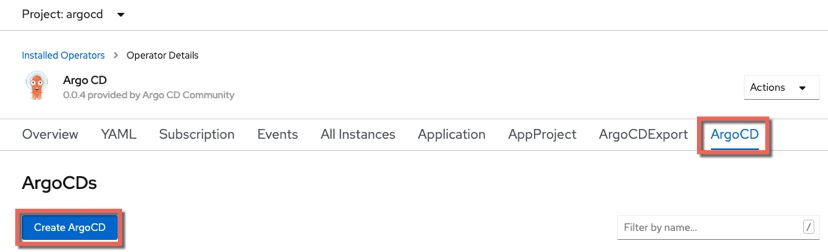
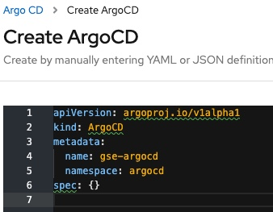

Installing ArgoCD in OCP 4.3
---
## Introduction
ArgoCD provides an Operator in OperatorHub to help with installation but there are some additional steps. It is assumed that you have already installed the ArgoCD CLI (click [here for instructions if you haven't](https://argoproj.github.io/argo-cd/cli_installation/))

## Installation of ArgoCD in OCP 4.3

- Create a namespace for ARGOCD
```
oc new-project argocd
```

- In the OCP UI navigate to **Operators --> OperatorHub**

- Search for the `ArgoCD` Operator and install it in to the `argocd` namespace

- Create an instance of the `ArgoCD Custom Resource Definition`

  

- When the YAML editor is displayed, change the name from `example-argocd` to something more useful. In this example I will use `gse-argocd`

  

- Click **Create**

- Issue the command below to get the server `pod name`
```
oc get pods -n argocd | grep argocd-server
```

The response will be similar to that shown below:
```
oc get pods -n argocd | grep argocd-server
gse-argocd-server-5c486f5666-2lqwb                   1/1     Running   0          10m
```

Note the **name** of the pod, in this case `gse-argocd-server-5c486f5666-2lqwb`

- Issue the command below to get the `route` for the ArgoCD server
```
oc get routes
```

The response will be similar to that shown below:
```
oc get routes
NAME                HOST/PORT                                                                                                       PATH   SERVICES            PORT    TERMINATION        WILDCARD
gse-argocd-server   gse-argocd-server-argocd.gse-appmod-0143c5dd31acd8e030a1d6e0ab1380e3-000.us-south.containers.appdomain.cloud          gse-argocd-server   https   passthrough/None   None
```

- Use the `wildcard` from the `route` to log in to the ArgoCD server as shown below:

```
argocd login --insecure gse-argocd-server-argocd.gse-appmod-0143c5dd31acd8e030a1d6e0ab1380e3-0001.us-south.containers.appdomain.cloud
```

Enter `admin` as the Username
Enter **the server pod name** as the Password (for example `gse-argocd-server-5c486f5666-2lqwb`)

- Once you are logged in, change the password using the command shown below:
```
argocd account update-password
```

- In the OCP UI, navigate to **Networking --> Routes** and click the link to access the ArgoCD UI

- Use `admin` and your new password to log in

## Conclusion
You've now installed ArgoCD in to OCP 4.3.
