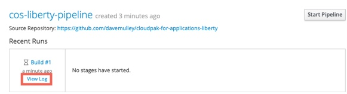
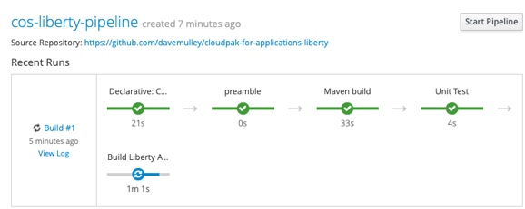
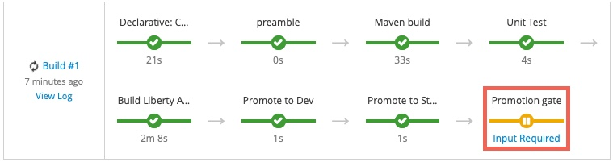
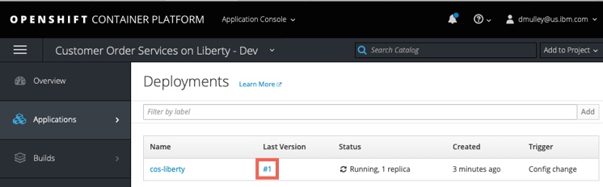
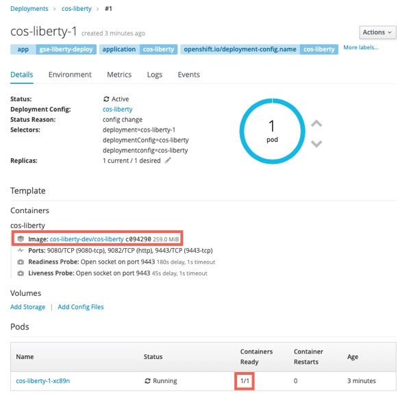
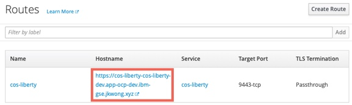
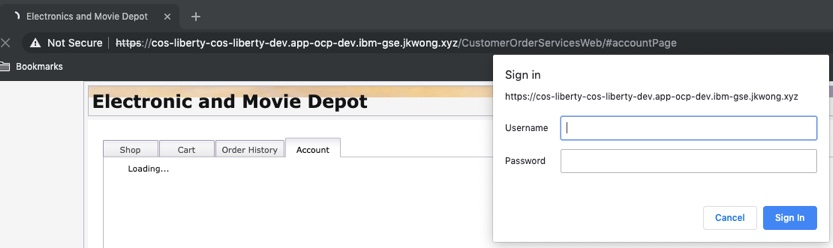

# Liberty - Deploy using Jenkins on OCP 3.11
This section covers how to deploy the application to RedHat OpenShift 3.11 using a Jenkins automated CI/CD pipeline. The diagram below shows the flow of the pipeline which starts when the developer checks their code in to Git and ends with the application being deployed in Production.

  

  1. the developer checks their code in to `git`
  2. a `webhook` automatically triggers the Jenkins Pipeline in the RHOS cluster
  3. the pipeline checks out the code from `git` and uses `maven` to build and test the application
  4. the `oc start build` command is used to build a `docker` image for the application
  5. the image is added to the `ImageStream` and pushed to the `docker registry` in the RHOS cluster
  6. the image is then `tagged` for the `dev` project
  7. the `deployment` running in the `dev` project is restarted using the newly created image
  8. the image is then `tagged` for the `stage` project
  9. the `deployment` running in the `stage` project is restarted using the newly created image
  10. the developer is prompted to `approve` the deployment to production
  11. the image is then `tagged` for the `prod` project
  12. the `deployment` running in the `prod` project is restarted using the newly created image

## Deploy the Application
The following steps will deploy the modernized Customer Order Services application in a WebSphere Liberty container to a RedHat OpenShift cluster.

### Prerequisites
You will need the following:

- [Git CLI](https://git-scm.com/book/en/v2/Getting-Started-Installing-Git)
- RedHat OpenShift 3.11 with Cluster Admin permissions
- [oc CLI](https://docs.openshift.com/container-platform/3.11/cli_reference/get_started_cli.html)
- DB2 Database

### Getting the project repository
You can clone the repository from its main GitHub repository page and checkout the appropriate branch for this version of the application.

```
git clone https://github.com/ibm-cloud-architecture/appmod-liberty-jenkins.git
cd appmod-liberty-jenkins
```

### Create application database infrastructure
As said in the prerequisites section above, the Customer Order Services application uses uses DB2 as its database. Follow these steps to create the appropriate database, tables and data the application needs to:

- Copy the createOrderDB.sql and initialDataSet.sql files you can find in the Common directory of this repository over to the db2 host machine (or git clone the repository) in order to execute them later.

- ssh into the db2 host

- Change to the db2 instance user: `su {database_instance_name}``

- Start db2: `db2start`

- Create the ORDERDB database: `db2 create database ORDERDB`

- Connect to the ORDERDB database: `db2 connect to ORDERDB`

- Execute the createOrderDB.sql script you copied over in step 1 in order to create the appropriate tables, relationships, primary keys, etc: `db2 -tf createOrderDB.sql`

- Execute the initialDataSet.sql script you copied over in step 1 to populate the ORDERDB database with the needed initial data set: `db2 -tf initialDataSet.sql`

If you want to re-run the scripts, please make sure you drop the databases and create them again.

### Create the Security Context Constraint
In order to deploy and run the WebSphere Liberty Docker image in an OpenShift cluster, we first need to configure certain security aspects for the cluster. The `Security Context Constraint` provided [here](https://github.com/ibm-cloud-architecture/appmod-liberty-jenkins/blob/master/Deployment/OpenShift/ssc.yaml) grants the [service account](https://kubernetes.io/docs/tasks/configure-pod-container/configure-service-account/) that the WebSphere Liberty Docker container is running under the required privileges to function correctly.

A **cluster administrator** can use the file provided [here](https://github.com/ibm-cloud-architecture/appmod-liberty-jenkins/blob/master/Deployment/OpenShift/ssc.yaml) with the following command to create the Security Context Constraint (SCC):

```
cd Deployment/OpenShift
oc apply -f ssc.yaml
```

### Create the projects
Four RedHat OpenShift projects are required in this scenario:

- Build: this project will contain the Jenkins server and the artifacts used to build the application image  
- Dev: this is the `development` environment for this application
- Stage: this is the `staging` environment for this application
- Prod: this is the `production` environment for this application

The file provided [here](https://github.com/ibm-cloud-architecture/appmod-liberty-jenkins/blob/master/Deployment/OpenShift/liberty-projects.yaml) contains the definitions for the four projects in a single file to make creation easier

Issue the command shown below to create the projects
```
oc create -f liberty-projects.yaml
```

### Create a service account
It is a good Kubernetes practice to create a [service account](https://kubernetes.io/docs/tasks/configure-pod-container/configure-service-account/) for your applications. A service account provides an identity for processes that run in a Pod. In this step we will create a new service account with the name `websphere` in each of the `dev`, `stage` and `prod` projects and add the Security Context Constraint created above to them.

Issue the commands shown below to create the `websphere` service account and bind the ibm-websphere-scc to it in each of the projects:
```
oc create serviceaccount websphere -n cos-liberty-dev
oc create serviceaccount websphere -n cos-liberty-stage
oc create serviceaccount websphere -n cos-liberty-prod
oc adm policy add-scc-to-user ibm-websphere-scc -z websphere -n cos-liberty-dev
oc adm policy add-scc-to-user ibm-websphere-scc -z websphere -n cos-liberty-stage
oc adm policy add-scc-to-user ibm-websphere-scc -z websphere -n cos-liberty-prod
```

### Deploy Jenkins
Some RedHat OpenShift clusters are configured to automatically provision a Jenkins instance in a build project. The steps below can be used if your cluster is not configured for automatic Jenkins provisioning:

```
oc project cos-liberty-build
oc new-app jenkins-persistent
```

## Update the Jenkins service account
During provisioning of the Jenkins master a service account with the name `jenkins` is created. This service account has privileges to create new artifacts only in the project that it is running in. In this scenario Jenkins will need to create artifacts in the `dev`, `stage` and `prod` projects.

Issue the commands below to allow the `jenkins` service account to `edit` artifacts in the `dev`, `stage` and `prod` projects.

```
oc policy add-role-to-user edit system:serviceaccount:cos-liberty-build:jenkins -n cos-liberty-dev
oc policy add-role-to-user edit system:serviceaccount:cos-liberty-build:jenkins -n cos-liberty-stage
oc policy add-role-to-user edit system:serviceaccount:cos-liberty-build:jenkins -n cos-liberty-prod
```

### Import the deployment templates
RedHat OpenShift [templates](https://docs.openshift.com/container-platform/3.11/dev_guide/templates.html) are used to make artifact creation easier and repeatable. The template definition provided [here](https://github.com/ibm-cloud-architecture/appmod-liberty-jenkins/blob/master/Deployment/OpenShift/template-liberty-deploy.yaml) defines a Kubernetes [`Service`](https://kubernetes.io/docs/concepts/services-networking/service/), [`Route`](https://docs.openshift.com/container-platform/3.11/architecture/networking/routes.html) and [`DeploymentConfig`](https://docs.openshift.com/container-platform/3.11/architecture/core_concepts/deployments.html#deployments-and-deployment-configurations) for the CustomerOrderServices application.

The `gse-liberty-deploy` template defines the following:

- `service` listening on ports `9080`, `9443` and `9082`
- `route` to expose the `9443` port externally
- `DeploymentConfig` to host the WebSphere Liberty container.
    - The `image` for the container is taken from the [`ImageStream`](https://docs.openshift.com/container-platform/3.11/dev_guide/managing_images.html) that will be populated by the Jenkins pipeline.
    - `environment variables` are defined for the DB2 database used by the application allowing for environment specific information to be injected
    - [Probes](https://kubernetes.io/docs/tasks/configure-pod-container/configure-liveness-readiness-probes/) for `liveness` and `readiness` are defined to check port 9443 is active
    - The `securityContext` is set to allow read/write access to the filesystem and to run the container as `user 1001`
    - The deployment will be updated if a new image is loaded to the `ImageStream` or if a change to the configuration is detected.

Issue the commands below to load the template named `gse-liberty-deploy` in the `dev`, `stage` and `prod` projects.

```
oc create -f template-liberty-deploy.yaml -n cos-liberty-dev
oc create -f template-liberty-deploy.yaml -n cos-liberty-stage
oc create -f template-liberty-deploy.yaml -n cos-liberty-prod
```

### Create the deployment definitions
In this step the `gse-liberty-deploy` template will be used to create a RedHat OpenShift [application](https://docs.openshift.com/container-platform/3.11/dev_guide/application_lifecycle/new_app.html) named `cos-liberty` in the `dev`, `stage` and `prod` namespaces.

The result will be:

- `service` listening on ports `9080`, `9443` and `9082`
- `route` to expose the `9443` port externally
- `DeploymentConfig` to host the WebSphere Liberty container. The deployment config will wait for a `docker image` to be loaded in to the `ImageStream` by the Jenkins pipeline.

Issue the following commands to create the applications from the template:

```
oc new-app gse-liberty-deploy -p APPLICATION_NAME=cos-liberty -p DB2_HOST=<your DB2 host> -p DB2_PORT=<your DB2 host> -p DB2_USER=<your DB2 user> -p DB2_PASSWORD=<your DB2 password> -n cos-liberty-dev
oc new-app gse-liberty-deploy -p APPLICATION_NAME=cos-liberty -p DB2_HOST=<your DB2 host> -p DB2_PORT=<your DB2 host> -p DB2_USER=<your DB2 user> -p DB2_PASSWORD=<your DB2 password> -n cos-liberty-stage
oc new-app gse-liberty-deploy -p APPLICATION_NAME=cos-liberty -p DB2_HOST=<your DB2 host> -p DB2_PORT=<your DB2 host> -p DB2_USER=<your DB2 user> -p DB2_PASSWORD=<your DB2 password> -n cos-liberty-prod
```

### Import the build templates
In this step a template for the `build` process will be loaded in to the `build` project. The template provided [here](https://github.com/ibm-cloud-architecture/appmod-liberty-jenkins/blob/master/Deployment/OpenShift/template-liberty-build.yaml) defines the following artifacts:

- An [ImageStream](https://docs.openshift.com/container-platform/3.11/dev_guide/managing_images.html) for the application image. This will be populated by the Jenkins Pipeline
- An ImageStream for WebSphere Liberty which will pull down the latest version of the `ibmcom/websphere-liberty:kernel-ubi-min` image and will monitor DockerHub for any updates.
- A `binary` [BuildConfig](https://docs.openshift.com/container-platform/3.11/dev_guide/builds/build_strategies.html) that will be used by the Jenkins Pipeline to build the application Docker image
- A `jenkinsfile` BuildConfig that defines the `Pipeline` using the `Jenkinsfile` in GitHub
- Parameters to allow the WebSphere Liberty image and GitHub repository to be provided when the template is instantiated

Issue the commands below to load the template named `gse-liberty-build` in the `build` projects.

```
oc create -f template-liberty-build.yaml -n cos-liberty-build
```

### Create the build definitions
In this step the `gse-liberty-build` template will be used to create a RedHat OpenShift [application](https://docs.openshift.com/container-platform/3.11/dev_guide/application_lifecycle/new_app.html) named `cos-liberty` in the `build` namespaces.

The result will be:

- An [ImageStream](https://docs.openshift.com/container-platform/3.11/dev_guide/managing_images.html) for the application image. This will be populated by the Jenkins Pipeline
- An ImageStream for WebSphere Liberty which will pull down the latest version of the `ibmcom/websphere-liberty:kernel-ubi-min` image and will monitor DockerHub for any updates.
- A `binary` [BuildConfig](https://docs.openshift.com/container-platform/3.11/dev_guide/builds/build_strategies.html) that will be used by the Jenkins Pipeline to build the application Docker image
- A `jenkinsfile` BuildConfig that defines the `Pipeline` using the `Jenkinsfile` in GitHub (with the URL provided as a parameter when the application is created)

Issue the following commands to create the application from the template:

```
oc new-app gse-liberty-build -p APPLICATION_NAME=cos-liberty -p SOURCE_URL="https://github.com/ibm-cloud-architecture/appmod-liberty-jenkins" -p SOURCE_REF="master" -n cos-liberty-build
```

### Run the pipeline  
The newly created pipeline can be started from the RedHat OpenShift console which allows access to the Jenkins logs but also tracks the progress in the OCP console.

- Navigate to **Application Console --> Customer Order Services on Liberty - Build --> Builds --> Pipelines** and click the **Start Pipeline** button

  

- When the pipeline starts, click the `view log` link to go to the Jenkins administration console. Note that it may take a couple of minutes before the `view log` link appears on the first pipeline build
    

- When prompted, log in with your OpenShift account and grant the required access permissions. The Jenkins console log will be displayed as shown below:
  

- Return to the OpenShift Console and track the progress of the pipeline
    

- The pipeline will eventually stop at the **Promotion Gate** for approval to deploy to Production. Click the **Input Required** link as shown below
    

- When the *Promote application to Production* question is displayed, click **Proceed**
    

- Return to the OpenShift Console and validate that the pipeline is now complete
    

## Validate the Application
Now that the pipeline is complete, validate the Customer Order Services application is deployed and running in `dev`, `stage` and `prod`

- In the OpenShift Console, navigate to **Application Console --> Customer Order Services on Liberty - Dev --> Applications --> Deployments** and click on the link in the **Latest Version** column  
  

- Information about the deployment will be displayed including the **image** that is being used (note the **tag** on the image as it will be the same in the `stage` and `prod` deployments). After a few minutes the container will be marked as **ready**  
  

- Click **Applications --> Routes** and click on the **route** for the application. Note that the URL is < application_name >-< project_name >.< ocp cluster url >. In this case the project name is `cos-liberty-dev`  
  

- Add `/CustomerOrderServicesWeb` to the end of the URL in the browser to access the application  
  

- Log in to the application with `username: rbarcia` and `password: bl0wfish`

- Repeat the validations for the `stage` and `prod` Projects.

## Review and Next Steps
In this section you configured a CI/CD pipeline for the CustomerOrderServices application that builds a single immutable image for the latest version of the application and then deploys it to three different environments.  
