# Liberty - Deploy using Tekton (OpenShift Pipelines) and ArgoCD on OCP 4.3
This section covers how to deploy the application to RedHat OpenShift 4.3 using a Tekton (OpenShift Pipelines) CI pipeline and ArgoCD. The diagram below shows the flow of the pipeline which starts when the developer checks their code in to Git and ends with the application being deployed in build and dev namespaces.

The diagram below shows the following flow:

- 1) A developer commits code to the `application repository`

- 2) A webhook starts a `tekton pipeline` running in the `build` project

- 3) A `tekton task` clones the application source code (4) from the application repository, uses `Maven` to compile and test the application before using `buildah` to create a `Docker image` which is pushed to the docker registry (5)

- 6) A `tekton task` deploys the `application` to the local namespace using the image from the `docker registry` (7)

- 8) A `tekton task` updates the `gitops repository` with the `docker image tag` for the newly created docker image and commits the change (9)

- 10) ArgoCD is used to `synchronize` the changes from the gitops repository with the `dev` namespace

- 11) The application running in the `dev` namespace is updated with the latest docker image from the registry

  

## Deploy the Application
The following steps will deploy the modernized Customer Order Services application in a WebSphere Liberty container to a RedHat OpenShift cluster.

### Prerequisites
You will need the following:

- [Git CLI](https://git-scm.com/book/en/v2/Getting-Started-Installing-Git)
- Red Hat OpenShift Container Platfrom 4.3 with Cluster Admin permissions
- [oc CLI](https://docs.openshift.com/container-platform/3.11/cli_reference/get_started_cli.html)
- DB2 Database
- [Red Hat OpenShift Pipelines](OpenShiftPipelinesInstall.md)
- [Tekton CLI](https://github.com/tektoncd/cli)
- [ArgoCD CLI](https://argoproj.github.io/argo-cd/cli_installation/)
- [ArgoCD](ArgoCDInstall.md)

### Fork the appmod-gitops repository
Fork the [appmod-gitops](https://github.com/ibm-cloud-architecture/appmod-gitops) GitHub repository in to your own github.com account

- Navigate to the [appmod-gitops](https://github.com/ibm-cloud-architecture/appmod-gitops) GitHub repository

- Click **Fork**

  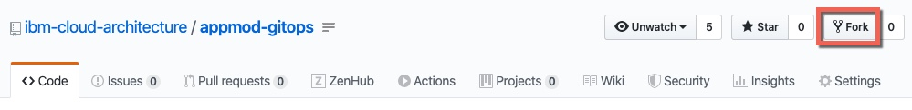

- Select the **Target** and wait for the fork process to complete

### Create a github access token
You will need to grant ArgoCD access to make changes to the newly forked Github repository

- Click on your GitHub.com account dropdown in the top right corner and select **Settings**

- Select **Developer settings** from the menu and then select **Personal Access Tokens**

- Click **Generate new token**

  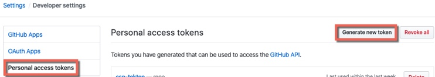

- Enter a `name` for the token in the `Note` field and select the `repo` scope as shown below. No other scopes are required. Click **Generate token**

  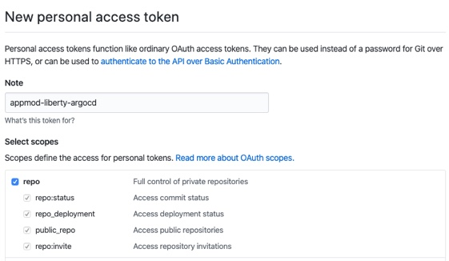

- **Copy** the token and **keep** it for a later step. This is the only time the token will be visible to you.

  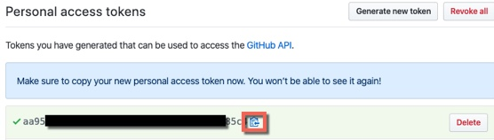

### Getting the project repository
You can clone the repository from its main GitHub repository page and checkout the appropriate branch for this version of the application.

```
git clone https://github.com/ibm-cloud-architecture/appmod-liberty-tekton.git
cd appmod-liberty-tekton
```

### Create application database infrastructure
As said in the prerequisites section above, the Customer Order Services application uses uses DB2 as its database. Follow these steps to create the appropriate database, tables and data the application needs to:

- Copy the createOrderDB.sql and initialDataSet.sql files you can find in the Common directory of this repository over to the db2 host machine (or git clone the repository) in order to execute them later.

- ssh into the db2 host

- Change to the db2 instance user: `su {database_instance_name}``

- Start db2: `db2start`

- Create the ORDERDB database: `db2 create database ORDERDB`

- Connect to the ORDERDB database: `db2 connect to ORDERDB`

- Execute the createOrderDB.sql script you copied over in step 1 in order to create the appropriate tables, relationships, primary keys, etc: `db2 -tf createOrderDB.sql`

- Execute the initialDataSet.sql script you copied over in step 1 to populate the ORDERDB database with the needed initial data set: `db2 -tf initialDataSet.sql`

If you want to re-run the scripts, please make sure you drop the databases and create them again.

### Create the Security Context Constraint
In order to deploy and run the WebSphere Liberty Docker image in an OpenShift cluster, we first need to configure certain security aspects for the cluster. The `Security Context Constraint` provided [here](https://github.com/ibm-cloud-architecture/appmod-liberty-tekton/blob/master/Deployment/OpenShift/ssc.yaml) grants the [service account](https://kubernetes.io/docs/tasks/configure-pod-container/configure-service-account/) that the WebSphere Liberty Docker container is running under the required privileges to function correctly.

A **cluster administrator** can use the file provided [here](https://github.com/ibm-cloud-architecture/appmod-liberty-tekton/blob/master/Deployment/OpenShift/ssc.yaml) with the following command to create the Security Context Constraint (SCC):

```
cd Deployment/OpenShift
oc apply -f ssc.yaml
```

### Create the build project
Create the project that will be used for the Tekton pipeline and the initial deployment of the application.

Issue the command shown below to create the project:
```
oc new-project cos-liberty-tekton
```

### Create a secret for your github access token
Edit the `tekton/tekton-argo/appmod-github-secret.yaml` file and set your `username` (to your github.com username) and `password` (to your **access token** created earlier)

```
apiVersion: v1
kind: Secret
metadata:
  name: dm-github
  annotations:
    tekton.dev/git-0: https://github.com # Described below
type: kubernetes.io/basic-auth
stringData:
  username: xxxxx  
  password: xxxxx
```

Execute the commands below to create the secret and bind it to the service account that Tekton will be using to execute the Tasks.

```
cd tekton/tekton-argo
oc apply -f appmod-github-secret.yaml
oc patch serviceaccount pipeline -p '{"secrets": [{"name": "appmod-github"}]}'
```

### Create a service account
It is a good Kubernetes practice to create a [service account](https://kubernetes.io/docs/tasks/configure-pod-container/configure-service-account/) for your applications. A service account provides an identity for processes that run in a Pod. In this step we will create a new service account with the name `websphere` and add the Security Context Constraint created above to it.

Issue the commands shown below to create the `websphere` service account and bind the ibm-websphere-scc to it in each of the projects:
```
oc create serviceaccount websphere -n cos-liberty-tekton
oc adm policy add-scc-to-user ibm-websphere-scc -z websphere -n cos-liberty-tekton
```

### Import the Tekton resources
Import the Tekton `Tasks`, `Pipeline` and `PipelineResources` in to the project using the commands shown below:

```
oc apply -f gse-apply-manifests-pvc-task.yaml
oc apply -f gse-gitops-pvc-task.yaml
oc apply -f gse-buildah-pvc-task.yaml
oc apply -f gse-build-gitops-pvc-pipeline.yaml
oc apply -f gse-build-pipeline-resources.yaml
```

### Create the dev project
Create the project that will be used for the `development` version of the application that will be deployed by `ArgoCD`.

Issue the command shown below to create the project:
```
oc new-project cos-liberty-dev
```

### Create a service account
Create a `websphere` service account in the new project using the commands below:
```
oc create serviceaccount websphere -n cos-liberty-dev
oc adm policy add-scc-to-user ibm-websphere-scc -z websphere -n cos-liberty-dev
```

### Update the service account
In order to `pull` the image that is created by the pipeline (which is in the `cos-liberty-tekton` namespace) a `role` must be added to the service account using the command shown below:
```
oc policy add-role-to-group system:image-puller system:serviceaccounts:cos-liberty-dev --namespace=cos-liberty-tekton
```

### Update the argocd service account
Use the command below to grant the `argocd-application-controller` access to the `cos-liberty-dev` namespace to make changes:
```
oc policy add-role-to-user edit system:serviceaccount:argocd:argocd-application-controller -n cos-liberty-dev
```

### Configure ArgoCD
In this step you will import a defintion of the cos-liberty application in to ArgoCD

- Log in to ArgoCD using the CLI as the admin user.
```
argocd login --insecure <url of your argocd server>
```

- Edit the `tekton/tekton-argo/argo-project.yaml` file and set your `repoURL` (to the URL of your forked repository from earlier)
```
apiVersion: argoproj.io/v1alpha1
kind: Application
metadata:
  name: cos-liberty
  namespace: argocd
spec:
  project: default
  source:
    repoURL: https://github.com/davemulley/test-gitops
    path: cos-liberty/dev
    targetRevision: HEAD
    directory:
      recurse: true
      jsonnet: {}
  destination:
    server: https://kubernetes.default.svc
    namespace: cos-liberty-dev
```

- Execute the following command to create the application definition in ArgoCD
```
argocd app create cos-liberty -f argo-project.yaml
```

- Log in to the ArgoCD UI as the `admin` user and validate that the application is shown on the **Applications** view

  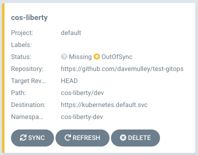


## Run the pipeline
The recommended way to trigger the pipeline would be via a webhook (**link**) but for simplicity the command line can be used. Issue the command below (replace the `GITOPS_REPO` value with the URL of your forked repository from earlier) to trigger the pipeline and accept the default values for `source` and `image`

```
tkn pipeline start  gse-build-gitops-pvc-pipeline -p GITOPS_REPO="https://github.com/davemulley/test-gitops.git" -n cos-liberty-tekton
```

When prompted, accept the default `git-source` value as shown below:

  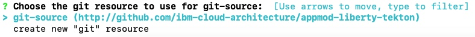

When prompted, accept the default `docker-image` value as shown below:

  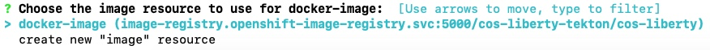

### View the pipeline logs
- In the OpenShift Container Platform UI, change to the **Developer** view, select the `cos-liberty-tekton` project and then select **Pipelines**. Click on the **Last Run**

  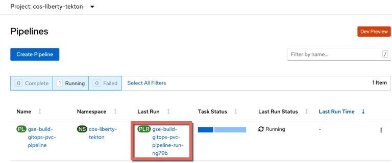

- Select **Logs**

  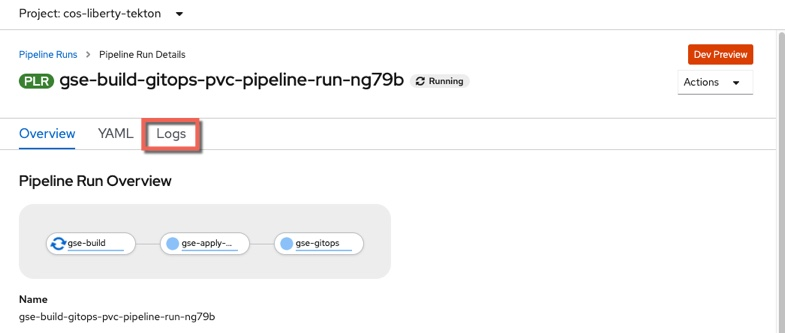

- The pipeline will execute and the logs will be displayed

  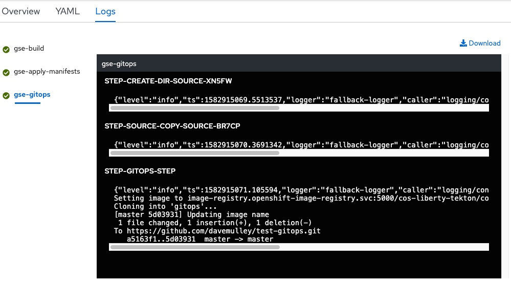

- Once both the `gse-build`, `gse-apply-manifests` and `gse-gitops` steps are complete, the pipeline is finished.

### Validate the application in the pipeline namespace
Now that the pipeline is complete, validate the Customer Order Services application is deployed and running in `cos-liberty-tekton` project

- In the OpenShift Console, navigate to **Topology** view and click on the `cos-liberty` DeploymentConfig to view deployment details, including `Pods` `Services` and `Routes`

#### Topology
  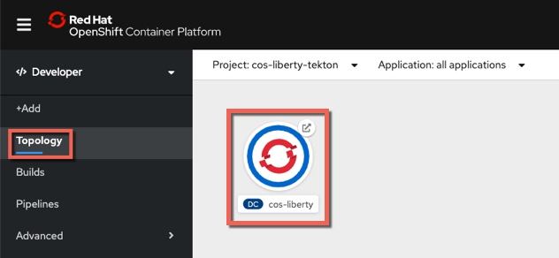

- From this view you can also view the **route** for the application. Note that the URL is < application_name >-< project_name >.< ocp cluster url >. In this case the project name is `cos-liberty-tekton`

  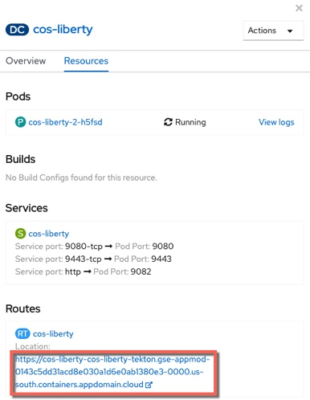

- Add `/CustomerOrderServicesWeb` to the end of the URL in the browser to access the application

  

- Log in to the application with `username: rbarcia` and `password: bl0wfish`

### Trigger the ArgoCD synchronization of the dev namespace
- In the ArgoCD UI, navigate to the **applications** view and click **SYNC** on the `cos-liberty` application

  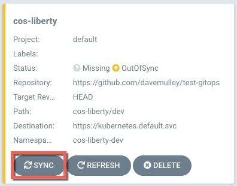

- On the panel that is displayed, click **SYNCHRONIZE** to synchronize all of the artifacts in to the `cos-liberty-dev` namespace

  

- Note that the **Status** is quickly shown as **Healthy, Synced**

  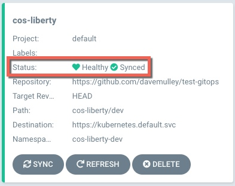

- Click on the **cos-liberty** application to drill-down to the more detailed view and note that the `deploymentconfig`, `service` and `route` have been created. Watch the application pod on the right be deployed and after a short while show as running

  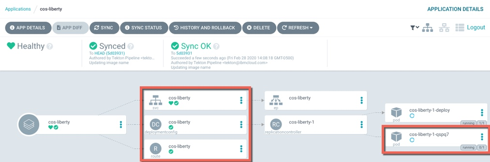

### Validate the application in the dev namespace
- In the OpenShift Console, navigate to the **cos-liberty-dev** project

- Now navigate to the **Topology** view and click on the `cos-liberty` DeploymentConfig to view deployment details, including `Pods` `Services` and `Routes`

#### Topology
  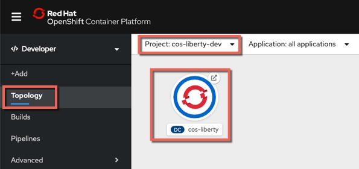

- From this view you can also view the **route** for the application. Note that the URL is < application_name >-< project_name >.< ocp cluster url >. In this case the project name is `cos-liberty-dev`

  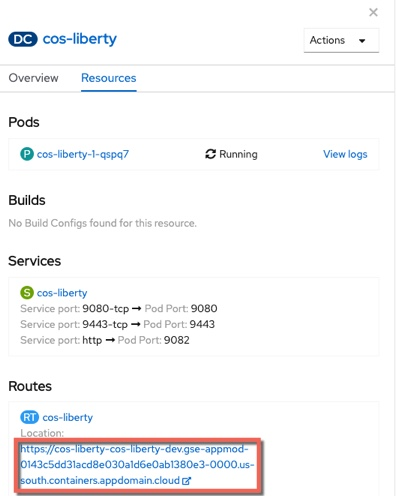

- Add `/CustomerOrderServicesWeb` to the end of the URL in the browser to access the application

  

- Log in to the application with `username: rbarcia` and `password: bl0wfish`

## Review and Next Steps
In this section you configured a CI/CD pipeline for the CustomerOrderServices application that builds a single immutable image for the latest version of the application and then deploys it to a dev environment.  
