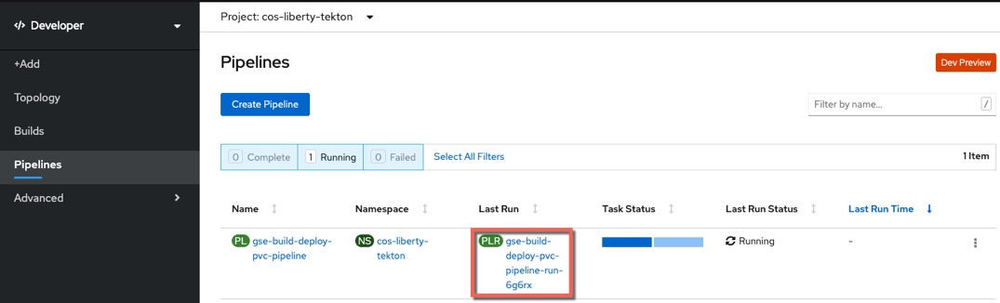
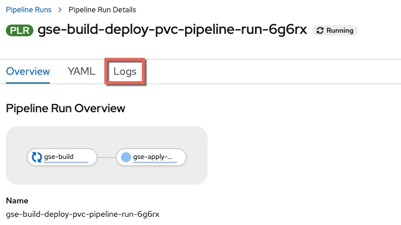
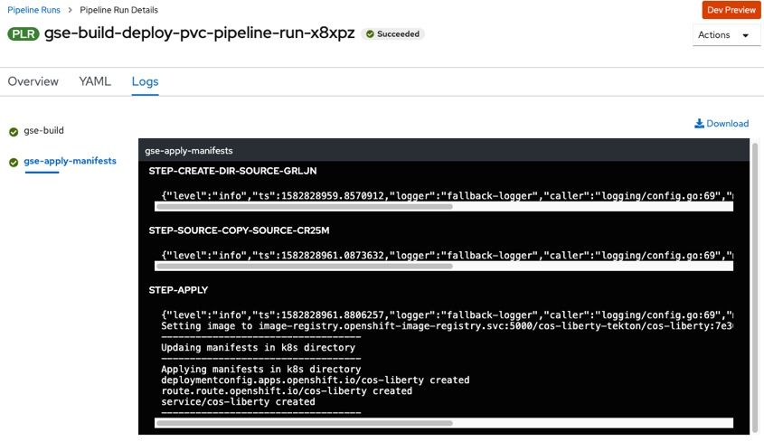

# Liberty - Deploy using Tekton (OpenShift Pipelines) on OCP 4.3
This section covers how to deploy the application to RedHat OpenShift 4.3 using a Tekton (OpenShift Pipelines) CI/CD pipeline. The diagram below shows the flow of the pipeline which starts when the developer checks their code in to Git and ends with the application being deployed in a build namespace.

The diagram below shows the following flow:

- 1) A developer commits code to the `application repository`

- 2) A webhook starts a `tekton pipeline` running in the `build` project

- 3) A `tekton task` clones the application source code (4) from the application repository, uses `Maven` to compile and test the application before using `buildah` to create a `Docker image` which is pushed to the docker registry (5)

- 6) A `tekton task` deploys the `application` to the local namespace using the image from the `docker registry` (7)

  

## Deploy the Application
The following steps will deploy the modernized Customer Order Services application in a WebSphere Liberty container to a RedHat OpenShift cluster.

### Prerequisites
You will need the following:

- [Git CLI](https://git-scm.com/book/en/v2/Getting-Started-Installing-Git)
- Red Hat OpenShift Container Platfrom 4.3 with Cluster Admin permissions
- [oc CLI](https://docs.openshift.com/container-platform/3.11/cli_reference/get_started_cli.html)
- DB2 Database
- [Red Hat OpenShift Pipelines](OpenShiftPipelinesInstall.md)
- [Tekton CLI](https://github.com/tektoncd/cli)

### Getting the project repository
You can clone the repository from its main GitHub repository page and checkout the appropriate branch for this version of the application.

```
git clone https://github.com/ibm-cloud-architecture/appmod-liberty-tekton.git
cd appmod-liberty-tekton
```

### Create application database infrastructure
As said in the prerequisites section above, the Customer Order Services application uses uses DB2 as its database. Follow these steps to create the appropriate database, tables and data the application needs to:

- Copy the createOrderDB.sql and initialDataSet.sql files you can find in the Common directory of this repository over to the db2 host machine (or git clone the repository) in order to execute them later.

- ssh into the db2 host

- Change to the db2 instance user: `su {database_instance_name}``

- Start db2: `db2start`

- Create the ORDERDB database: `db2 create database ORDERDB`

- Connect to the ORDERDB database: `db2 connect to ORDERDB`

- Execute the createOrderDB.sql script you copied over in step 1 in order to create the appropriate tables, relationships, primary keys, etc: `db2 -tf createOrderDB.sql`

- Execute the initialDataSet.sql script you copied over in step 1 to populate the ORDERDB database with the needed initial data set: `db2 -tf initialDataSet.sql`

If you want to re-run the scripts, please make sure you drop the databases and create them again.

### Create the Security Context Constraint
In order to deploy and run the WebSphere Liberty Docker image in an OpenShift cluster, we first need to configure certain security aspects for the cluster. The `Security Context Constraint` provided [here](https://github.com/ibm-cloud-architecture/appmod-liberty-tekton/blob/master/Deployment/OpenShift/ssc.yaml) grants the [service account](https://kubernetes.io/docs/tasks/configure-pod-container/configure-service-account/) that the WebSphere Liberty Docker container is running under the required privileges to function correctly.

A **cluster administrator** can use the file provided [here](https://github.com/ibm-cloud-architecture/appmod-liberty-tekton/blob/master/Deployment/OpenShift/ssc.yaml) with the following command to create the Security Context Constraint (SCC):

```
cd Deployment/OpenShift
oc apply -f ssc.yaml
```

### Create the build project
Create the project that will be used for the Tekton pipeline and the initial deployment of the application.

Issue the command shown below to create the project:
```
oc new-project cos-liberty-tekton
```

### Create a service account
It is a good Kubernetes practice to create a [service account](https://kubernetes.io/docs/tasks/configure-pod-container/configure-service-account/) for your applications. A service account provides an identity for processes that run in a Pod. In this step we will create a new service account with the name `websphere` and add the Security Context Constraint created above to it.

Issue the commands shown below to create the `websphere` service account and bind the ibm-websphere-scc to it in each of the projects:
```
oc create serviceaccount websphere -n cos-liberty-tekton
oc adm policy add-scc-to-user ibm-websphere-scc -z websphere -n cos-liberty-tekton
```

### Import the Tekton resources
Import the Tekton `Tasks`, `Pipeline` and `PipelineResources` in to the project using the commands shown below:

```
cd ../../tekton/tekton-only
oc apply -f gse-apply-manifests-pvc-task.yaml
oc apply -f gse-buildah-pvc-task.yaml
oc apply -f gse-build-deploy-pvc-pipeline.yaml
oc apply -f gse-build-pipeline-resources.yaml
```

### Run the pipeline
The recommended way to trigger the pipeline would be via a webhook (**link**) but for simplicity the command line can be used. Issue the command below to trigger the pipeline:

```
tkn pipeline start  gse-build-deploy-pvc-pipeline -n cos-liberty-tekton
```

When prompted, accept the default `git-source` value as shown below:

  

When prompted, accept the default `docker-image` value as shown below:

  

### View the pipeline logs
- In the OpenShift Container Platform UI, change to the **Developer** view, select the `cos-liberty-tekton` project and then select **Pipelines**. Click on the **Last Run**

  

- Select **Logs**

  

- The pipeline will execute and the logs will be displayed

  

- Once both the `gse-build` and `gse-apply-manifests` steps are complete, the pipeline is finished.

### Validate the application
Now that the pipeline is complete, validate the Customer Order Services application is deployed and running in `cos-liberty-tekton` project

- In the OpenShift Console, navigate to **Topology** view and click on the `cos-liberty` DeploymentConfig to view deployment details, including `Pods` `Services` and `Routes`

#### Topology
  

- From this view you can also view the **route** for the application. Note that the URL is < application_name >-< project_name >.< ocp cluster url >. In this case the project name is `cos-liberty-tekton`

  

- Add `/CustomerOrderServicesWeb` to the end of the URL in the browser to access the application

  

- Log in to the application with `username: rbarcia` and `password: bl0wfish`

## Review and Next Steps
In this section you configured a CI/CD pipeline for the CustomerOrderServices application that builds a single immutable image for the latest version of the application and then deploys it to a dev environment.  
