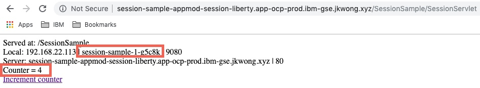
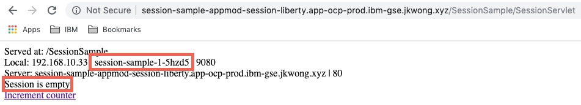
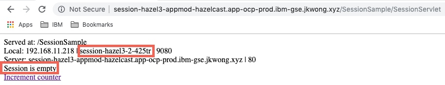
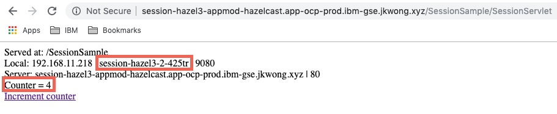
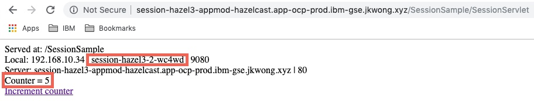

# Session state management considerations

One of the [12 factor](https://12factor.net/) principles is that applications and services should be stateless. Many existing monolith applications rely heavily on HTTP sessions. When you are modernizing your application it is a good practice to rearchitect them to be stateless, but some times it is not an easy task and you need to postpone it for a while.

There are following methods that you can use in container world to handle session state, depending on your requirements:
- session affinity
- session replication using caching mechanisms
- session persistence using database


## Session affinity

Session affinity is the simplest mechanism for maintaining session state. Using this mechanism, requests from the same session will be routed to the same POD. Selecting this solution, you have to be aware that PODs are not like on-premise servers, they may be restarted much often, in many circumstances. So this solution might be applicable to applications that need relatively short lived sessions, and can tolerate loosing session data.

### Deploying with session affinity

Session affinity on OpenShift utilizes Route configuration. You don't have to make any changes in your application code or during building application container, all is done on deployment time.

In this example, a simple application has been deployed to WebSphere Liberty that displays the contents of the *session* and allows updates to be made to a *counter* that is stored in the session as well as displaying the name of the *pod* that services the request. There are multiple instances of the application pod running:

```
oc get pods | grep sample
session-sample-1-bzpd7   1/1     Running   0          10d
session-sample-1-dnpsg   1/1     Running   0          10d
session-sample-1-g5c8k   1/1     Running   0          21d
```

On the first request, the output is as shown below with the name of the pod an empty session. Since this is first request, currently there is no data in the session. You can also see name of the pod that runs the application.


After a few requests to the app, using the link or reloading the page, the the counter value that is taken from the session increases as shwon below. Note that the requests are routed to the same pod. Session affinity is working.



If the pod is then deleted it will be replaced by OpenShift:

```
oc delete pod session-sample-1-g5c8k
pod "session-sample-1-g5c8k" deleted

oc get pods | grep sample
session-sample-1-5hzd5   1/1     Running   0          3m
session-sample-1-7w8gh   1/1     Running   0          23s
session-sample-1-dnpsg   1/1     Running   0          10d
```

If an attempt is then made to refresh the browser page or increment the count then the request is routed to the different pod and session state is lost:



If you want to ensure that session state is not lost when pod is removed, you will need to configure session caching or session persistence.

## Session replication using caching mechanisms
Very often session affinity is not enough for application requirements and you need session state to be preserved in case of pod failure. One of the mechanisms that could be used is *session caching*. WebSphere Liberty has a `sessionCache-1.0` feature which provides distributed in-memory HttpSession caching. The `sessionCache-1.0` feature builds on top of an existing technology called [JCache (JSR 107)](https://www.jcp.org/en/jsr/detail?id=107), which offers a standardized distributed in-memory caching API.

The `sessionCache-1.0` feature does not include a JCache implementation, so you need to pick one and reference it as a `<library>` in your `server.xml`. WebSphere/Open Liberty supports the following JCache implementations:
- Hazelcast
- WebSphere Extreme Scale
- Infinispan
- Ehcache

### Prepare DockerFile with caching configuration
This article shows how to enable [Hazelcast In-Memory Data Grid](https://hazelcast.org/), as it is easily available in many private cloud solutions.

Enabling Hazelcast session caching retrieves the Hazelcast client libraries from the [hazelcast/hazelcast](https://hub.docker.com/r/hazelcast/hazelcast/) Docker image, configures Hazelcast by copying a sample hazelcast.xml, and configures the Liberty server feature sessionCache-1.0 by including the XML snippet hazelcast-sessioncache.xml. By default, the Hazelcast Discovery Plugin for Kubernetes will auto-discover its peers within the same Kubernetes namespace. To enable this functionality, the Docker image author can include the following Dockerfile snippet, and choose from either client-server or embedded topology.

Modify your current Dockerfile with the following lines:

```dockerfile
### Hazelcast Session Caching ###
# Copy the Hazelcast libraries from the Hazelcast Docker image - paths for WebSphere Liberty
COPY --from=hazelcast/hazelcast --chown=1001:0 /opt/hazelcast/lib/*.jar /opt/ibm/wlp/usr/shared/resources/hazelcast/

# Copy the Hazelcast libraries from the Hazelcast Docker image - paths for Open Liberty
# COPY --from=hazelcast/hazelcast --chown=1001:0 /opt/hazelcast/lib/*.jar /opt/ol/wlp/usr/shared/resources/hazelcast/

# Instruct configure.sh to copy the client topology hazelcast.xml
ARG HZ_SESSION_CACHE=client

# Instruct configure.sh to copy the embedded topology hazelcast.xml and set the required system property
#ARG HZ_SESSION_CACHE=embedded
#ENV JAVA_TOOL_OPTIONS="-Dhazelcast.jcache.provider.type=server ${JAVA_TOOL_OPTIONS}"

## This script will add the requested XML snippets and grow image to be fit-for-purpose
RUN configure.sh
```

### Deploy Hazelcast in OpenShift
Hazelcast can be used in OpenShift. By default it requires paid version - Hazelcast Enterprise. But you can use also free version [Hazelcast OpenShift Origin](https://github.com/hazelcast/hazelcast-code-samples/blob/master/hazelcast-integration/openshift/hazelcast-cluster/hazelcast-openshift-origin). See details on this page [Hazelcast for OpenShift](https://github.com/hazelcast/hazelcast-code-samples/tree/master/hazelcast-integration/openshift)

For this article you will use Hazelcast OpenShift Origin.

#### Deploy Hazelcast cluster
Easiest way to deploy Hazelcast is to use [hazelcast.yaml](https://github.com/hazelcast/hazelcast-code-samples/blob/master/hazelcast-integration/openshift/hazelcast-cluster/hazelcast-openshift-origin/hazelcast.yaml) file provided by Hazelcast

Create project for Hazelcast cluster

`$ oc new-project appmod-hazelcast`

Deploy Hazelcast cluster

`$ oc new-app -f hazelcast.yaml -p NAMESPACE=appmod-hazelcast`

Check the status of deployed cluster

```
$ oc get all
NAME              READY     STATUS              RESTARTS   AGE
pod/hazelcast-0   1/1       Running             0          1m
pod/hazelcast-1   1/1       Running             0          42s
pod/hazelcast-2   0/1       ContainerCreating   0          2s

NAME                        TYPE           CLUSTER-IP        EXTERNAL-IP                     PORT(S)          AGE
service/hazelcast-service   LoadBalancer   x.x.x.x             y.y.y.y                       5701:32567/TCP   1m

NAME                         DESIRED   CURRENT   AGE
statefulset.apps/hazelcast   3         3         1m
```

This cluster contains 3 replicas, look in one of the pods logs to check if all members are correctly detected. Look for similar messages:

```
$ oc get pods

Members {size:3, ver:7} [
	Member [192.168.16.15]:5701 - 9dc4af56-6df8-4a65-9890-68bf99e0ea5a
	Member [192.168.12.16]:5701 - f927d37c-860d-4b38-88b4-b1f3dd97bfd1 this
	Member [192.168.22.15]:5701 - ec8602a7-59b0-4dab-8446-3a8f32dac845
]
```

#### Deploy OpenLiberty configured for Hazelcast
The Hazelcast client configured with OpenLiberty is using Kubernetes API to find Hazelcast cluster and requires a new ServiceAccount and ClusterRoleBinding

Create project for the client application:

`$ oc new-project appmod-hazelcast-liberty`

Create a new ServiceAccount:

`$ oc create serviceaccount hazelcast-liberty -n appmod-hazelcast-liberty`

Create rbac.yaml with the following content:

```yaml
apiVersion: rbac.authorization.k8s.io/v1
kind: ClusterRoleBinding
metadata:
  name: default-cluster
roleRef:
  apiGroup: rbac.authorization.k8s.io
  kind: ClusterRole
  name: view
subjects:
- kind: ServiceAccount
  name: hazelcast-liberty
  namespace: appmod-hazelcast-liberty

```

Then, apply `rbac.yaml`:

```bash
$ kubectl apply -f rbac.yaml
```

*Note*: You can be even more strict with the permissions and create your own Role. For details, please check the implementation of [Hazelcast Helm Chart](https://github.com/helm/charts/tree/master/stable/hazelcast).

The following changes are required to a WebSphere Liberty deployment on OpenShift in order to use Hazelcast:

- an environment variable: `KUBERNETES_NAMESPACE` that is set to the namespace that Hazelcast is deployed in to
- the deployment much be updated to use the new serviceAccount by adding  the following to the `template/spec` section:

```
serviceAccountName: hazelcast-liberty
serviceAccount: hazelcast-liberty
```

In order to validate that the in-memory session cache is working a similar test to the session affinity test is executed. There are two pods running the application:

```
oc get pods
NAME                     READY   STATUS    RESTARTS   AGE
session-hazel3-2-425tr   1/1     Running   0          9d
session-hazel3-2-p5gtd   1/1     Running   0          9d
```

On the first request shown below, the session is empty and the pod is `session-hazel3-2-425tr`



After a few requests to the app, the same pod is being used and the session is being retained



If the pod is then deleted it will be replaced by OpenShift:

```
oc delete pod session-hazel3-2-425tr
pod "session-hazel3-2-425tr" deleted

oc get pods
NAME                     READY   STATUS    RESTARTS   AGE
session-hazel3-2-p5gtd   1/1     Running   0          9d
session-hazel3-2-wc4wd   1/1     Running   0          18s
```

If an attempt is then made to refresh the browser page or increment the count then the request is routed to the different pod (`session-hazel3-2--wc4wd`) but the session state is retained:




## Session persistence using database

In some cases you may want to use database instead of cache for storing session data, especially if you earlier already were using database as session persistent layer.

WebSphere Liberty fully supports session persistence using data base using `sessionDatabase-1.0` feature. You will utilize dynamic configuration support in Liberty to configure session persistence without modifying your original server configuration.

### Liberty configuration

Create new configuration file `session-db.xml` with the following contents. It configures required feature, database driver libraries, datasource, and http session management.

```xml
<server description="Demonstrates HTTP Session Persistence Configuration">
  <featureManager>
          <feature>sessionDatabase-1.0</feature>
  </featureManager>

  <library id="DB2Lib">
    <fileset dir="${server.config.dir}/resources/db2" includes="*.jar"/>
  </library>

  <dataSource id="SessionsDS">
    <jdbcDriver libraryRef="DB2Lib"/>
    <properties.db2.jcc databaseName="${env.DB2_DBNAME}" password="${env.DB2_PASSWORD}" portNumber="${env.DB2_PORT}" serverName="${env.DB2_HOST}" user="${env.DB2_USER}"/>
    <connectionManager agedTimeout="0" connectionTimeout="180" maxIdleTime="1800" maxPoolSize="10" minPoolSize="1" reapTime="180"/>
  </dataSource>

  <httpSessionDatabase id="SessionDB" dataSourceRef="SessionsDS"/>
  <httpSession cloneId="${env.HOSTNAME}"/>

</server>

```

In the configuration you are utilizing environment variables for database access parameters such as host, port, userid, etc (e.g. `${env.DB2_HOST}`). These variables will be provided during the deployment.

### Modifying the Dockerfile

As now solution requires additional configuration file and database driver to access session database, that needs to be added to the Dockerfile.

```
# session persistence
COPY --chown=1001:0 db2drivers/ /config/resources/db2
COPY --chown=1001:0 src/main/liberty/config/session-db.xml /config/configDropins/overrides/
```

### Deploying to OpenShift
The only changes required to an existing WebSphere Liberty deployment are to add the Environment Variables for the DB2 database that is being used as the session database:

- Environment Variables: `DB2_HOST`, `DB2_PORT`, `DB2_DBNAME`, `DB2_USER` and `DB2_PASSWORD` should be added to the deployment.

The same test that has been used for *session affinity* and *in-memory session cache* can be used to validate *session persistence using a database*.

## Summary
In this article we have demonstrated how to use session affinity, session caching using an in-memory cache and session persistence using a database with WebSphere Liberty on OpenShift.
