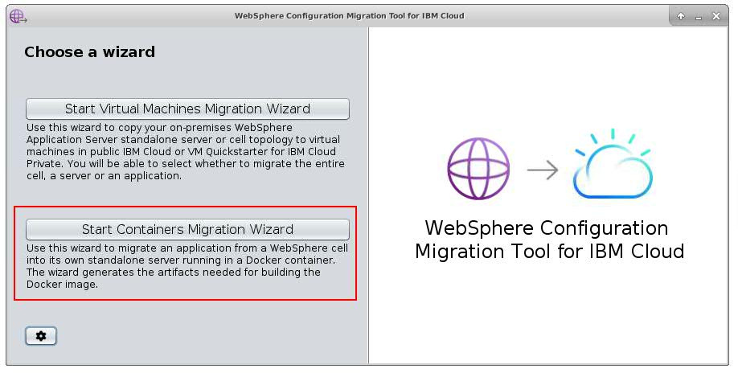
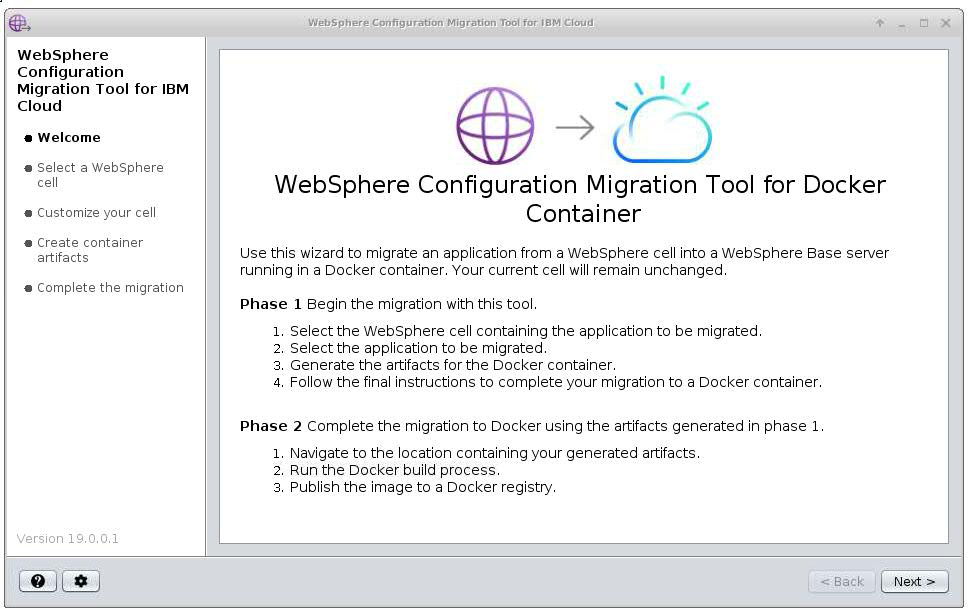
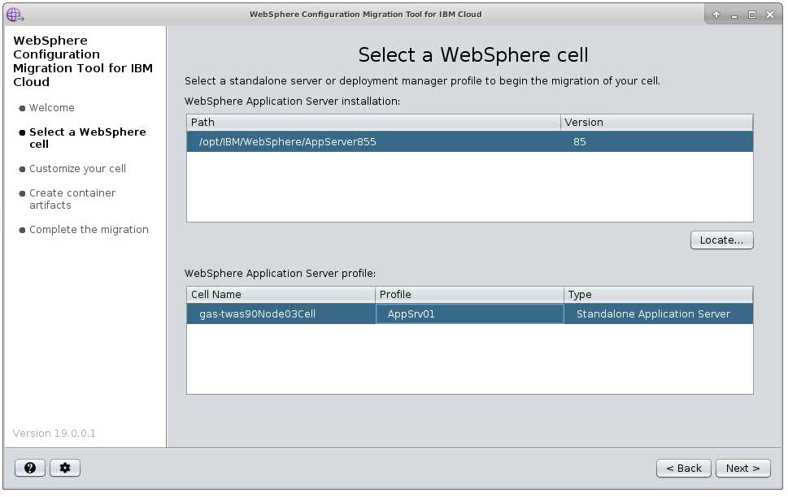
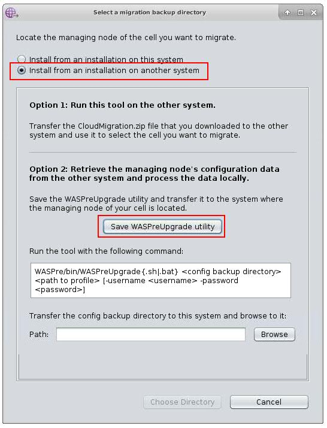
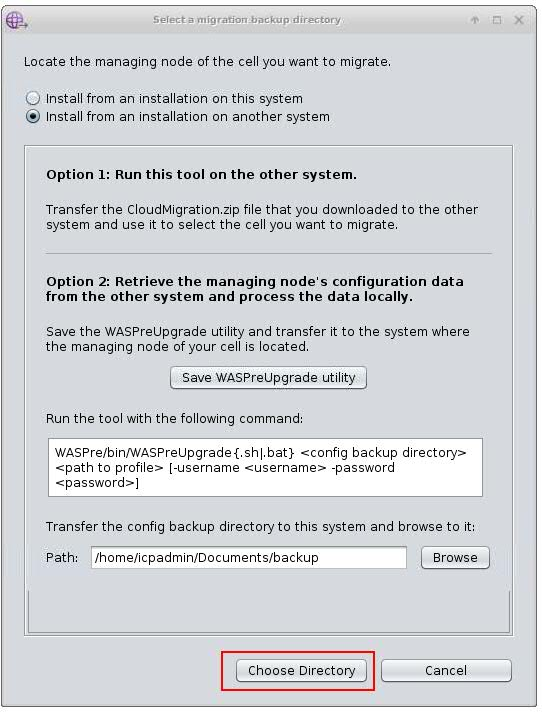
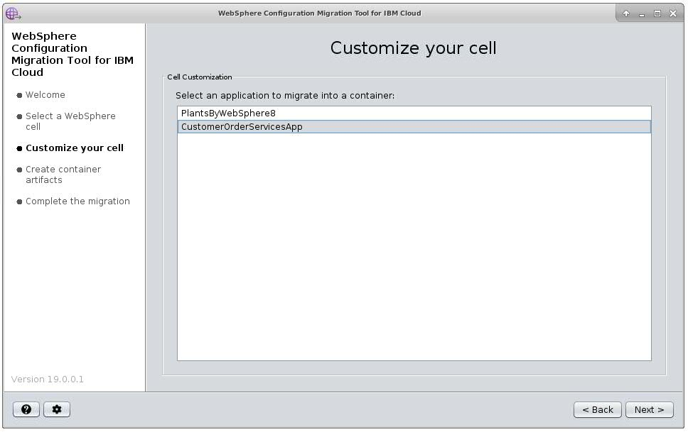
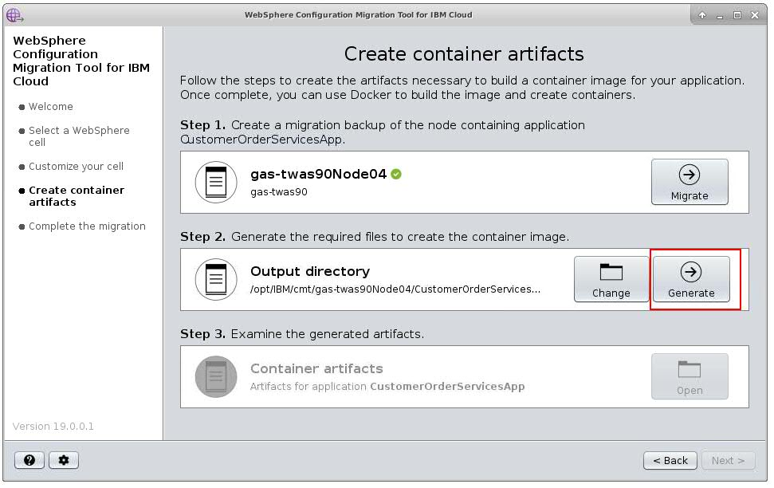
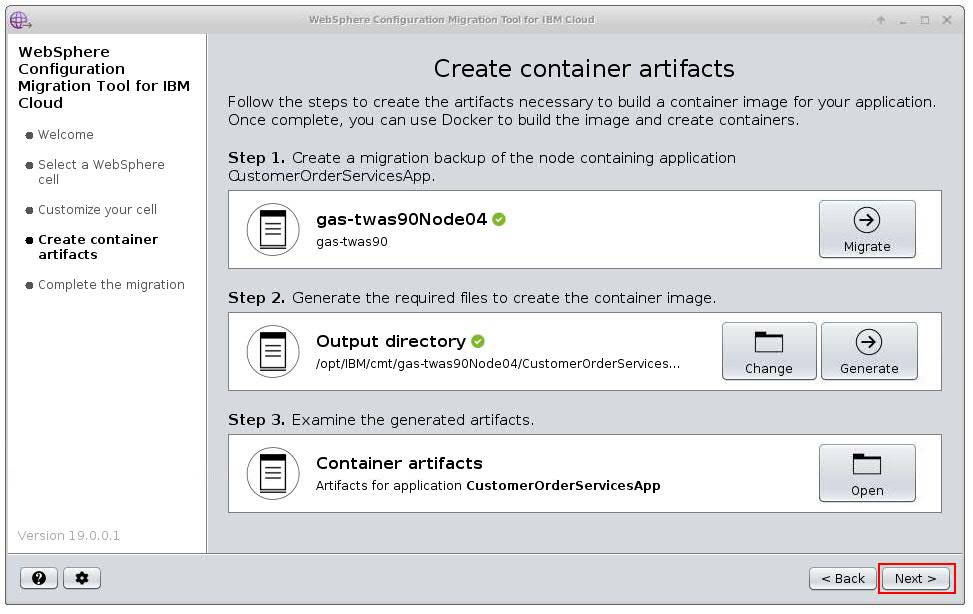
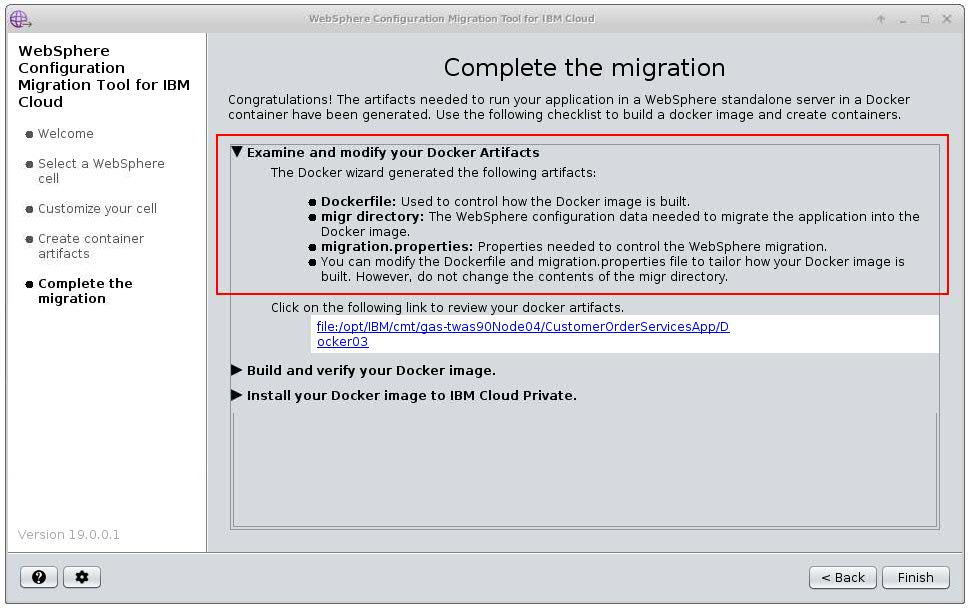

# Building a tWAS container from an existing environment (without scripts)

This section covers how to containerize an existing application running on traditional WebSphere Application Server.  Ideally a user would have scripts to configure their environment and building a container using scripts is descibed [here](tWAS-build.md). However if you don't have scripts and building those scripts is a daunting task, you can migrate your existing configuration using the [WebSphere Configuration Migration Tool for IBM Cloud (WCMT4IC)](https://developer.ibm.com/wasdev/docs/websphere-config-migration-cloud/).  This tool extracts the configuration from your existing traditional WebSphere Application Server environment and puts it into a tWAS container. 


## Summary: 
This section has the following steps:

- Run [WebSphere Configuration Migration Tool for IBM Cloud (WCMT4IC)] to extract the server configuration information from an existing environment.
- [Using environment variables in properties files to allow configuration to be injected in to the runtime environment dynamically.](tWAS-build.md#modifying-configuration-without-rebuilding-container)
- Running the application in a Docker container locally


## Introduction to the WebSphere Configuration Migration Tool for IBM Cloud
WCMT4IC is a Java based tool, that provides an easy to use wizard for cloning your WebSphere V7, V8, V855 or V9 environment to the IBM Cloud or to your IBM Cloud Private installation. It allows you to selectively migrate an application deployed in your WebSphere cell into its own WebSphere standalone server, which can run on a virtual machine or in a Docker container ready to be deployed in IBM Cloud Private (ICP).

This article focuses on the steps required to migrate to a Docker container.

## Install WebSphere Configuration Migration Tool for IBM Cloud
WCMT4IC is freely available to download from [here](https://developer.ibm.com/wasdev/downloads/#asset/tools-WebSphere_Configuration_Migration_Tool_for_IBM_Cloud). To install the tool extract downloaded file to new directory. As the tool requires Java 8 or higher, make sure Java is available in your PATH environment variable. If not, you can set it like this:

For Windows:

```set PATH=C:\java\bin;%PATH%```

where ```C:\java``` points to you existing Java installation directory


For Linux/Mac:

```export PATH=/opt/java8/bin:$PATH```

where ```/opt/java8/``` points to you existing Java installation directory

To start the tool run this command for the installation folder:

```java -jar CloudMigration.jar```

The tool can either be installed and run on the machine where WebSphere Application Server is installed or on a remote location. 

## Using the tool to generate artifacts
After you start the tool, it opens the following window where you can choose either Virtual Machine wizard or Container (Docker) wizard. In this guide you will use the container one.

1. Click **Start Containers Migration Wizard**



2. The welcome screen is shown, which describes overview of the steps. Click **Next >**



3. WebSphere cell selection screen is shown. If you are running the tool on the same machine where WebSphere is installed, then the installation folder and list of available cells(profiles) are automatically populated. Select cell and click **Next >**. Alternatively, if installation folder is not populated or WebSphere is not installed locally, click **Locate ...** button to work with remote installation. **If you are running locally, go directly to step 5**.



4a. (Optional - Remote installation only) Select **Install from an installation on another server** and then click **Save WASPreUpgrade utility**.



4b. Select directory, specify filename for WASPreUpgrade utility archive and click **Save**


4c. Utility is being saved


4d. Transfer the generated utility archive to the target server and unzip it. Utility requires ```JAVA_HOME``` environment variable. You can set it like this.
For Windows:

```set JAVA_HOME=C:\WebSphere\AppServer\java```

where ```C:\WebSphere\AppServer\java``` points to you existing Java installation directory


For Linux/Mac:

```export JAVA_HOME=/opt/WebSphere/AppServer/java```

where ```/opt/WebSphere/AppServer/java``` points to you existing Java installation directory

Run the utility using the following command:

```WASPre/bin/WASPreUpgrade.sh /home/icpadmin/Documents/backup /opt/IBM/WebSphere/AppServer855/profiles/AppSrv01```

4e. Zip backup folder using the command:

```zip -r backup.zip backup```

4f. Transfer archive to machine with WCMT4IC and unzip it. In the tool click **Browse** button, locate unzipped folder, select it and click **Open**


4g. Ensure that correct directory is visible and click **Choose Directory**



4h. Your WebSphere cell and profile data are prefilled, select required profile and click **Next**


5. Select application to be migrated and click **Next**




6. Generate container artifacts. The first step is to create the migration backup directory for the node containing the selected application to be migrated. Click **Migrate**.


7. If WebSphere global security is enabled you will be prompted for the userid and password.


8. Second step is to generate the required files to create container image. You may change target directory or accept the default provided. Click **Generate**



9. Third step is to examine generated files. You will do it later. Click **Next**



10. Artifacts are successfully generated, now you need to review and customize them according to your needs. Generated artifacts include:
- Dockerfile
- Migration directory
- migration.properties

.

## Modify artifacts


Here is [generated Dockerfile](artifacts/tWAS-build-WCMT/Dockerfile_generated). This is not enough in our case. The migrated application required database drivers, which was defined via WebSphere variable and located in the external directory.


You have to copy the drivers to the generated directory where Dockerfile is located and modify Dockerfile with information where to put them in the image. Add highlighted line to Dockerfile.

```COPY --from=migration --chown=was:0 /opt/IBM/WebSphere/AppServer/java/8.0/jre/lib/security/java.security /opt/IBM/WebSphere/AppServer/java/8.0/jre/lib/security/```
**```COPY --chown=was:0 db2drivers/ /opt/IBM/db2drivers/```**
```ENV ADMIN_USER_NAME=wasadmin```

Here you can find final version of the [Dockerfile](artifacts/tWAS-build/Dockerfile).

What if you would like to modify some settings in the migrated WebSphere?
You can customize your image using property-based configuration mechanism. All available objects are described [Managing specific configuration objects using properties files](https://www.ibm.com/support/knowledgecenter/en/SS7JFU_8.5.5/com.ibm.websphere.express.doc/ae/txml_config_prop.html).
Let's say you would like to change value of this ```DB2UNIVERSAL_JDBC_DRIVER_PATH``` variable.

You can create the db2env.props file, with the following contents:

```
ResourceType=VariableMap
ImplementingResourceType=VariableMap
ResourceId=Cell=!{cellName}:Node=!{nodeName}:Server=!{serverName}:VariableMap=
AttributeInfo=entries(symbolicName,value)
DB2UNIVERSAL_JDBC_DRIVER_PATH=/mydrivers/db2
```

and add these to the Dockerfile in the following way:

```
COPY --chown=was:0 db2env.props /work/config/db2env.props
RUN /work/configure.sh
```

This works for changes to the configuration you want to make at **build** time.  There are other options for configuration changes you would want to make at **deploy** time.  Jump to this section [here](tWAS-build.md#modifying-configuration-without-rebuilding-container)


## Build the image

See section in [tWAS-build.md](tWAS-build.md#Build-the-image)

## Test the image

See section in [tWAS-build.md](tWAS-build.md#test-the-image)


## Modifying Configuration without rebuilding container

See section in [tWAS-build.md](tWAS-build.md#Modifying-configuration-without-rebuilding-container)

## Conclusion

In conclusion, we've taken our estisting traditional WebSphere application.  We've loaded the container with the server and application configuration.  We've installed the application, and modified the configuration if required.  This sets us up for integrating all of this into a CI/CD pipeline and then deploying this to Kubernetes. 

We're on our way to the cloud!
