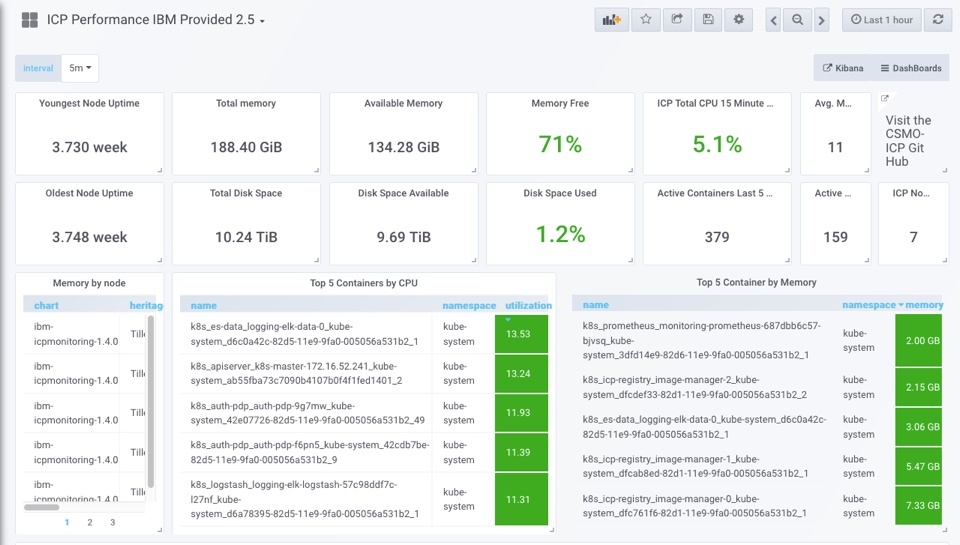
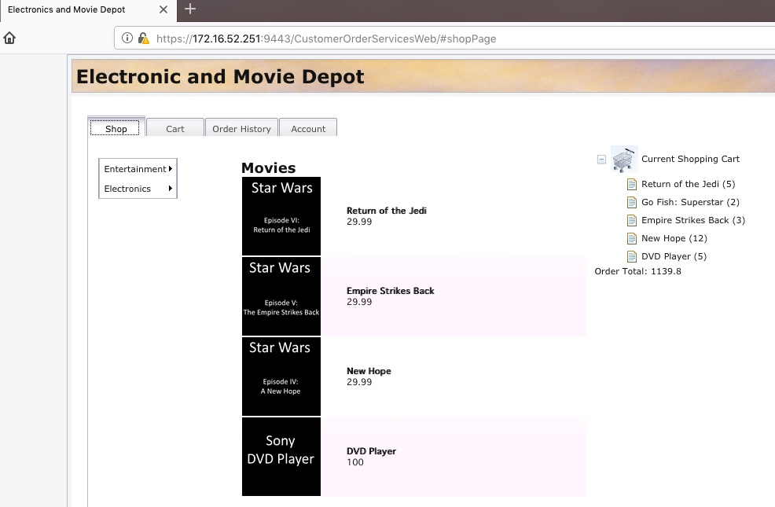
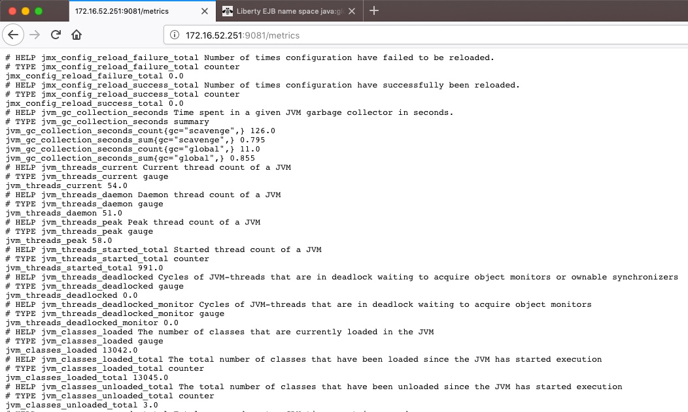

# Liberty - Build
This section covers how to make the minimal code changes required to allow the application to run on the Liberty runtime and how to create the configuration required for the Liberty runtime. The Liberty runtime and Docker image configuration will take in to account factors such as the requirement to inject environment specific configuration (such as JDBC Datasource User IDs and Passwords) at runtime and how to integrate with the Logging and Monitoring framework of the Cloud platform.

The final versions of the files created in this section can be found in the `liberty` branch of [this repo](https://github.com/ibm-cloud-architecture/cloudpak-for-applications/tree/liberty)

## Summary
This section has the following steps:

1. Make minimal code changes to the application based on the analysis from IBM Cloud Transformation Advisor

2. Create the WebSphere Liberty configuration file `server.xml` for the Customer Order Services application. This includes:
  - listing the WebSphere Liberty runtime features that are required
  - configuring a DB2 Data Source
  - configuring a local user registry
  - using environment variables in the `server.xml` file to allow configuration to be injected in to the runtime environment dynamically such as the DB2 user and password.  

3. Configuring WebSphere Liberty to expose internal metrics in a way that they can be collected by Prometheus

4. Creating a `Dockerfile` and running the application in a Docker container locally


## Code changes
In the previous section IBM Cloud Transformation Advisor highlighted a change in the way that Enterprise JavaBeans are looked up in Liberty.

**Behavior change on lookups for Enterprise JavaBeans** In Liberty, EJB components are not bound to a server root Java Naming and Directory Interface (JNDI) namespace as they are in WebSphere Application Server traditional. The fix for this is to change the three classes that use `ejblocal` to use the correct URL for Liberty

The three Java classes that should be modified to look up Enterprise JavaBeans differently are shown in the detailed analysis view of IBM Cloud Transformation Advisor (it isn't necessary to change the `ibm-web-bnd.xml` file in the `Test` project in this scenario) to be in the `CustomerOrderServicesWeb` project

  

  `org.pwte.example.resources.CategoryResource.java` is changed from using `ejblocal` on line 28 as shown below:

```java
...
InitialContext().lookup("ejblocal:org.pwte.example.service.ProductSearchService");
...
```

  to use `java:app` as shown below:

```java
...
InitialContext().lookup("java:app/CustomerOrderServices/ProductSearchServiceImpl!org.pwte.example.service.ProductSearchService");
...
```    	

  line 53 of `org.pwte.example.resources.CustomerOrderResource.java` is changed as shown below:

```java
...
ctx.lookup("java:app/CustomerOrderServices/CustomerOrderServicesImpl!org.pwte.example.service.CustomerOrderServices");
...
```

  line 38 of `org.pwte.example.resources.ProductResource.java` is changed as shown below:

```java
...
InitialContext().lookup("java:app/CustomerOrderServices/ProductSearchServiceImpl!org.pwte.example.service.ProductSearchService");
...
```

This completes all of the required code changes for the Customer Order Services application to run on the WebSphere Liberty runtime.

## Create the WebSphere Liberty server.xml file
WebSphere Liberty is configured by exception. The runtime environment operates from a set of built-in configuration default settings, and you only need to specify configuration that overrides those default settings. You do this by editing either the `server.xml` file or another XML file that is included in `server.xml` at run time. The configuration has the following characteristics:
- Described in XML files.
- Human-readable, and editable in a text editor.
- Small, easy to back up, and easy to copy to another system.
- Shareable across an application development team.
- Composable, so that features can easily add their own configuration to the system.
- Extensibly-typed, so you don't have to modify the current configuration to work with later versions of the runtime environment.
- Dynamically responsive to updates.
- Forgiving, so that missing values are assumed and unrecognized properties are ignored.

**Features** are the units of functionality by which you control the pieces of the runtime environment that are loaded into a particular server. They are the primary mechanism that makes the server composable. The list of features that you specify in the server configuration provides a functional server. See [Liberty features]((https://www.ibm.com/support/knowledgecenter/SSEQTP_liberty/com.ibm.websphere.wlp.doc/ae/rwlp_feat.html) for more information.

In this section, the `server.xml` file to prepare the Liberty server to run the Customer Order Services application will be reviewed. The file can be found [here](https://github.com/ibm-cloud-architecture/cloudpak-for-applications/blob/liberty/liberty/server.xml). and is shown below:


```xml
<server>
  <featureManager>
      <feature>appSecurity-2.0</feature>
      <feature>ldapRegistry-3.0</feature>
      <feature>localConnector-1.0</feature>
      <feature>ejbLite-3.1</feature>
      <feature>jaxrs-1.1</feature>
      <feature>jdbc-4.1</feature>
      <feature>jpa-2.0</feature>
      <feature>jsp-2.3</feature>
      <feature>servlet-3.1</feature>
      <feature>monitor-1.0</feature>
  </featureManager>

  <library id="DB2Lib">
    <fileset dir="/opt/ibm/wlp/usr/shared/resources/db2" includes="db2jcc4.jar db2jcc_license_cu.jar"/>
  </library>

  <dataSource id="OrderDS" jndiName="jdbc/orderds" type="javax.sql.XADataSource">
    <jdbcDriver libraryRef="DB2Lib"/>
    <properties.db2.jcc databaseName="${env.DB2_DBNAME}" password="${env.DB2_PASSWORD}" portNumber="${env.DB2_PORT}" serverName="${env.DB2_HOST}" user="${env.DB2_USER}"/>
    <connectionManager agedTimeout="0" connectionTimeout="180" maxIdleTime="1800" maxPoolSize="10" minPoolSize="1" reapTime="180"/>
  </dataSource>

  <httpEndpoint host="*" httpPort="9080" httpsPort="9443" id="defaultHttpEndpoint">
    <tcpOptions soReuseAddr="true"/>
  </httpEndpoint>

  <keyStore id="defaultKeyStore" password="whodunit"/>
  <!-- User and group security definitions -->

  <basicRegistry id="basic" realm="customRealm">
   	<user name="rbarcia" password="bl0wfish"/>
   	<group name="SecureShopper">
      <member name="rbarcia"/>
     </group>
  </basicRegistry>

  <applicationMonitor updateTrigger="mbean"/>

  <application id="customerOrderServicesApp" name="CustomerOrderServicesApp-0.1.0-SNAPSHOT.ear" type="ear" location="CustomerOrderServicesApp-0.1.0-SNAPSHOT.ear">
    <classloader apiTypeVisibility="spec, ibm-api, third-party" />
  </application>

</server>
```

The `features` section contains the following features:
- `ejbLite-3.1`: the feature required to run simple Stateless Session Enterprise Java Beans
- `jpa-2.0`, `jdbc-4.1`: the features required for the JPA 2.0 runtime
- `jaxrs-1-1`: the feature required for the JAX-RS 1.1 runtime
- `servlet-3.1`, `jsp-2.3`: the features required for Servlets and JSPs
- `ldapRegistry-3.0`, `appSecurity-2.0`: the features required to secure access to the application using LDAP or a local user registry
- `monitor-1.0`: this feature enables the Performance Monitoring Infrastructure (PMI) for other features the server is running. Monitoring data is accessible through standard MXBeans.

The `library` and `dataSource` sections configure a `JDBC Driver` for DB2 and a `DataSource` for the database used by the application. Note that some values have a `{env.}` prefix which is used to allow the values to be read from the environment instead of being hard-coded. This will be discussed in more detail in the **Environment Specific Configuration** section later.

The `basicRegistry` section configures a local user registry with a single user (`rbarcia`) and a single group (`SecureShopper`). This is often used for development and testing when an LDAP server isn't available and is sufficient for this scenario.

The `applicationMonitor` tag is used with Eclipse and triggers the application to be reloaded when a deployment from Eclipse occurs.

The `application` tag describes the CustomerOrderServices EAR with an `id`, `name` and `location`. In this case the default location of the `apps` folder is used. The `classloader` tag is used to allow the application access to the Java Classes that make up the JEE specification (`spec`), some IBM provided APIs (`ibm-api`) and third-party classes such as `apache-wink` as these classes are hidden from the application by default.

The `classloader` is configured becuase IBM Cloud Transformation Advisor highlighted that the application needed access to the Apach Wink APIs:

**The user of system provided Apache Wink APIs requires configuration** To use system-provided third-party APIs in Liberty applications, you must configure the applications to include the APIs. In WebSphere Application Server traditional, these APIs are available without configuration. This is a configuration only change and can be achieved by using a `classloader` definition in the Liberty server.xml file.

### Environment Specific Configuration
Applications deployed to an Application Server typically require access to backend services such as Databases, Message Queues, LDAP servers and other applications. Connection information for the backend services might include URL, Hostname, Port, UserID and Password and this information is often different depending on the environment (e.g. Dev, Test or Production) that the application is deployed to. In the case of the Customer Order Services application, a connection to a DB2 database is required.

In order to take advantage of the portability provided by a platform such as Kubernetes and the speed of DevOps it is necessary to deploy applications in **immutable** containers using automation.

In this context, **immutable** means that a container will not be modified during its life: no updates, no patches, no configuration changes. If you need to update the application code or apply a patch, you build a new image and deploy it. In order to achieve this, it is necessary to inject environment specific configuration in to the container in each environment (Database UserIDs and Passwords for example) instead of hard-coding the values in properties files in the container.

The goal is to deploy the application in a portable, immutable container and in order to achieve that any **environment specific** configuration should be externalized from the container image and injected by the platform. In the Kubernetes world this is achieved using Environment Variables, ConfigMaps and Secrets.

Using the `env.` prefex in the WebSphere Liberty `server.xml` forces the runtime to use the value of the environment variable when the server starts. See the [documentation](https://www.ibm.com/support/knowledgecenter/en/SSEQTP_liberty/com.ibm.websphere.wlp.doc/ae/twlp_setup_vars.html) for more details. In the snippet below from the Customer Order Services application `server.xml` file, the `host`, `portNumber`, `databaseName`, `user` and `password` have all been externalized as **environment variables** which allows this application image to be moved between environments that have different databases without changing the image.

```xml
<dataSource id="OrderDS" jndiName="jdbc/orderds" type="javax.sql.XADataSource">
  <jdbcDriver libraryRef="DB2Lib"/>
  <properties.db2.jcc databaseName="${env.DB2_DBNAME}" password="${env.DB2_PASSWORD}" portNumber="${env.DB2_PORT}" serverName="${env.DB2_HOST}" user="${env.DB2_USER}"/>
  <connectionManager agedTimeout="0" connectionTimeout="180" maxIdleTime="1800" maxPoolSize="10" minPoolSize="1" reapTime="180"/>
</dataSource>
```

In a native development environment (non-Docker) a `server.env` file can be used to inject the environment variables directly in to WebSphere Liberty when it starts. This avoids having to set environment variables on the development machine. This file is placed in the same folder as the `server.xml` file and is read by Liberty on startup. The file can be found [here](https://github.com/ibm-cloud-architecture/cloudpak-for-applications/blob/liberty/liberty/server.env). and is shown below:
```
DB2_HOST=172.16.52.252
DB2_PORT=50000
DB2_DBNAME=ORDERDB
DB2_USER=db2inst1
DB2_PASSWORD=db2inst1
```

### Monitoring
[Prometheus](https://prometheus.io/) and [Grafana](https://grafana.com) are used by the IBM CloudPak for Application to monitor applications running in Kubernetes. Prometheus is a systems and service monitoring system. It collects metrics from configured targets at given intervals, evaluates rule expressions, displays the results, and can trigger alerts if some condition is observed to be true.

Prometheus has several components for the collection of Time Series Data, an Alert Manager and a central Prometheus Server which scrapes and stores the data. The data is visualized using a Grafana instance.

#### Kubernetes Monitoring
Prometheus can monitor Kubernetes and the application pods. For Kubernetes data is related to the overall cluster state such as pod state (running, pending, error etc), cluster CPU usage and cluster RAM usage. Individual pod data is also available including CPU and RAM usage. This data is useful for an overall cluster view but it doesn't provide application specific data.



#### Application Monitoring
Prometheus can pull metrics data from applications using **scraping**. It is the responsibility of the application to make their metrics available on a `/metrics` endpoint which Prometheus *scrapes* and stores the data in its database for later visualization using Grafana.

An example of the results from a `/metrics` scrape are shown below. Metrics related to connection pools, thread pools, CPU, memory and JVM heap usage are more useful for a Java application that the basic pod metrics available by default.

```
base:classloader_current_loaded_class_count 16266
base:classloader_total_loaded_class_count 16372
base:classloader_total_unloaded_class_count 106
base:cpu_available_processors 8
base:cpu_process_cpu_load_percent 8.262355256251326E-4
base:gc_global_count 245
base:gc_global_time_seconds 13.756
base:gc_scavenge_count 9467
base:gc_scavenge_time_seconds 21.759
base:jvm_uptime_seconds 346146.925
base:memory_committed_heap_bytes 7.1892992E7
base:memory_max_heap_bytes 5.36870912E8
base:memory_used_heap_bytes 5.0641512E7
base:thread_count 77
base:thread_daemon_count 74
base:thread_max_count 91
vendor:connectionpool_jdbc_orderds_connection_handles 0
vendor:connectionpool_jdbc_orderds_create_total 7
vendor:connectionpool_jdbc_orderds_destroy_total 7
vendor:connectionpool_jdbc_orderds_free_connections 0
vendor:connectionpool_jdbc_orderds_in_use_time_total_seconds 0.71
vendor:connectionpool_jdbc_orderds_managed_connections 0
vendor:connectionpool_jdbc_orderds_queued_requests_total 0
vendor:connectionpool_jdbc_orderds_used_connections_total 7
vendor:connectionpool_jdbc_orderds_wait_time_total_seconds 0.0
vendor:servlet_com_ibm_ws_microprofile_metrics_public_public_metrics_rest_proxy_servlet_request_total 5771
vendor:servlet_com_ibm_ws_microprofile_metrics_public_public_metrics_rest_proxy_servlet_response_time_total_seconds 27.157690424000002
vendor:servlet_customer_order_services_app_org_pwte_example_app_customer_services_app_request_total 6
vendor:servlet_customer_order_services_app_org_pwte_example_app_customer_services_app_response_time_total_seconds 1.889112088
vendor:session_default_host_metrics_active_sessions 0
vendor:session_default_host_metrics_create_total 1
vendor:session_default_host_metrics_invalidated_total 1
vendor:session_default_host_metrics_invalidatedby_timeout_total 1
vendor:session_default_host_metrics_live_sessions 0
vendor:threadpool_default_executor_active_threads 1
vendor:threadpool_default_executor_size 24
```

#### Metrics scraping with WebSphere Liberty
WebSphere Liberty provides a `monitoring-1.0` feature which enables the Performance Monitoring Infrastructure (PMI) for other features the server is running and makes the monitoring data available via MXBeans. **Prometheus cannot scrape MXBeans**.

WebSphere Liberty also provides a `mpMetrics` feature which takes the data from the MXBeans and exposes it on a `/metrics` endpoint that can be read by Prometheus. **However, the mpMetrics feature is only available to applications using JavaEE7 or newer features.**

The Customer Order Services application uses the `jpa-2.0`, `jaxrs-1.1` and `ejbLite-3.1` features which are older than JavaEE7 and is therefore unable to use the `mpMetrics` feature and can't expose a `/metrics` endpoint for Prometheus.

#### Prometheus JMX exporter
A solution to the problem that the Customer Order Services application has is to use [Prometheus JMX exporter](https://github.com/prometheus/jmx_exporter). The Prometheus JMX exporter connects to any MXBeans on a JVM, retrieves their data and exposes the results on a `/metrics` endpoint so that the data can be scraped by Prometheus.  

The JMX exporter is made up of a [JAR file](https://github.com/ibm-cloud-architecture/cloudpak-for-applications/tree/liberty/resources/jmx_exporter) and a [configuration file](https://github.com/ibm-cloud-architecture/cloudpak-for-applications/blob/liberty/resources/jmx_exporter/jmx-config.yml). The configuration file used for the Customer Order Services application is shown below.

```
---
startDelaySeconds: 0
ssl: false
lowercaseOutputName: false
lowercaseOutputLabelNames: false
```

In order to connect the JMX exporter and configuration file to Liberty on startup, a `jvm.options` file is required. The [jvm.options](https://github.com/ibm-cloud-architecture/cloudpak-for-applications/blob/liberty/liberty/jvm.options) file is shown below.

```
-javaagent:/opt/ibm/wlp/usr/shared/resources/jmx_exporter/jmx_prometheus_javaagent-0.11.0.jar=9081:/opt/ibm/wlp/usr/shared/resources/jmx_exporter/jmx-config.yml
```

An example of the dashboard that is now possible in Grafana is shown below. In this case the dashboard shows data about Servlets and Thread Pools.


More details related to the metrics exposed by WebSphere Liberty and how to visualize them with Grafana will be covered in the [**Liberty - Deploy** section](liberty-deploy.md)

## Project Structure
The git project for the Customer Order Services application already has the following structure:

```
├── CustomerOrderServices
|   ├── ejbModule
|   |   └── <source code>
│   └── pom.xml
├── CustomerOrderServicesApp
│   ├── META-INF
|   |   └── <descriptor files>
│   └── pom.xml
├── CustomerOrderServiceProject
│   └── pom.xml
├── CustomerOrderServiceTest
│   ├── WebContent
│   ├── src
|   |   └── <source code>
│   └── pom.xml
└── CustomerOrderServiceWeb
    ├── WebContent
    ├── src
    |   └── <source code>
    └── pom.xml
```

It is now necessary to add the WebSphere Liberty, DB2 and JMX Exporter files to the git project so that they can be pulled in to the Docker image during Docker build.

The following folders and files have been added to the project:

```
├── resources
|   ├── db2
|   |   └── db2jcc4.jar
|   |   └── db2jcc_license_cu.jar
│   └── jmx_exporter
|   |   └── jmx-config.yml
|   |   └── jmx_prometheus_javaagent-0.11.0.jar
└── liberty
    └── server.xml
    └── server.env
    └── jvm.options
```

## Create the Docker Dockerfile
Once the application code changes have been made and WebSphere Liberty configuration has been created the next step is to build a Docker image that contains the application and configuration. The build script to create a Docker image is a [Dockerfile](https://docs.docker.com/engine/reference/builder/).

The `Dockerfile` for the Customer Order Services application is shown below. The file can be found [here](https://github.com/ibm-cloud-architecture/cloudpak-for-applications/blob/liberty/Dockerfile)
```
FROM ibmcom/websphere-liberty:kernel-ubi-min

COPY --chown=1001:0 ./liberty/server.xml /config
COPY --chown=1001:0 ./liberty/server.env /config
COPY --chown=1001:0 ./liberty/jvm.options /config

ARG SSL=false
ARG MP_MONITORING=false
ARG HTTP_ENDPOINT=false

COPY --chown=1001:0 ./CustomerOrderServicesApp/target/CustomerOrderServicesApp-0.1.0-SNAPSHOT.ear /config/apps/CustomerOrderServicesApp-0.1.0-SNAPSHOT.ear
COPY --chown=1001:0 ./resources/ /opt/ibm/wlp/usr/shared/resources/

USER 1001
RUN configure.sh
```

IBM provides a set of WebSphere Liberty [Docker images](https://hub.docker.com/_/websphere-liberty) that are part of the IBM CloudPak for Applications. This scenario uses the Docker images that are based on the [RedHat Universal Base Image](https://www.redhat.com/en/blog/introducing-red-hat-universal-base-image). The `ibmcom/websphere-liberty:kernel-ubi-min` image contains only the smallest components of the Liberty server. The features used by the application are loaded in to the Docker image later in the `RUN configure.sh` step.

The first two `COPY` commands copy the `server.xml` and `jvm.options` files to the `/config` folder on the WebSphere Liberty image. Later in the Dockerfile there are other `COPY` commands to copy the application that has been created by Maven to `/config/apps` and the `DB2 drivers`, `JMX exporter JAR` and `JMX exporter configuration file` to the shared resources folder for Liberty.

## Run the application locally
Now that the application code changes have been made, the WebSphere Liberty configuration has been created and the Dockerfile is ready, the next step is to build a Docker image and run an instance locally to validate that the application runs correctly.

1. The app requires a DB2 database. You can run it in a pre-built container:
 
 ```
 docker run -itd --name db2-cos --privileged=true -p 50000:50000 -e LICENSE=accept -e DB2INST1_PASSWORD=db2inst1 -e DBNAME=orderdb vandepol/db2-cos
 ```

2. Clone the GitHub repo and switch to the `liberty` branch using the following steps:

  ```
  git clone SOME_REPO
  cd cloudpak-for-applications
  git checkout liberty
  ```

3. Use Maven to build the application

  ```
  cd CustomerOrderServicesProject
  mvn clean package
  ```

  The `CustomerOrderServicesApp-0.1.0-SNAPSHOT.ear` file should now be present in `CustomerOrderServicesApp/target/`

4. Modify the `liberty/server.env` file for your environment as shown below:

  ```
  DB2_HOST=db2-cos
  DB2_PORT=50000
  DB2_DBNAME=ORDERDB
  DB2_USER=db2inst1
  DB2_PASSWORD=db2inst1
  ```

5. Build the Docker image using the following commands:

  ```
  cd ../cloudpak-for-applications
  docker build -t customerorderservices-local:1.0 .
  ```

  The end of the `docker build` command output should be similar to that shown below:

  ```
  ...
  All assets were successfully installed.

  Start product validation...
  Product validation completed successfully.
  + sort -z
  + xargs -0 -n 1 -r -I '{}' java -jar '{}' --installLocation /opt/ibm/wlp
  + find /opt/ibm/fixes -type f -name '*.jar' -print0
  + xargs -0 -r chmod -R g+rw
  + find /opt/ibm/wlp -perm -g=w -print0
  + /opt/ibm/wlp/bin/server start

  Starting server defaultServer.
  Server defaultServer started with process ID 127.
  + /opt/ibm/wlp/bin/server stop

  Stopping server defaultServer.
  Server defaultServer stopped.
  + rm -rf /output/resources/security/ /output/messaging /logs/console.log /logs/messages.log /logs/messages_19.06.25_16.12.03.0.log /opt/ibm/wlp/output/.classCache
  + chmod -R g+rwx /opt/ibm/wlp/output/defaultServer
  + find /opt/ibm/wlp -type d -perm -g=x -print0
  + xargs -0 -r chmod -R g+rwx
  Removing intermediate container c08b8b001320
   ---> 2897b25fa45e
  Successfully built 2897b25fa45e
  Successfully tagged customerorderservices-local:1.0

  ```

6. Run the newly created Docker image using the commands below:

  ```
  docker run --name customerorderservices-local -d -p 9081:9081 -p 9443:9443 customerorderservices-local:1.0
  ```

  This command injects the server.env file in the correct location so that it is loaded by WebSphere Liberty on startup.

7. In order to allow the application container to the database container, everything needs to run in one network.

 ```
 docker network create myNetwork
 docker network connect myNetwork db2-cos
 docker network connect myNetwork customerorderservices-local
 ```

8. Check the logs for the WebSphere Liberty server using:

  ```
  docker logs customerorderservices-local
  ```

  The result should be that the server is started without error and the application is loaded:

  ```
  root@gas-twas90:~/djm/latest/cloudpak-for-applications/liberty# docker logs customerorderservices-local

  Launching defaultServer (WebSphere Application Server 19.0.0.5/wlp-1.0.28.cl190520190522-2227) on IBM J9 VM, version 8.0.5.36 - pxa6480sr5fp36-20190510_01(SR5 FP36) (en_US)
  [AUDIT   ] CWWKE0001I: The server defaultServer has been launched.
  [AUDIT   ] CWWKE0100I: This product is licensed for development, and limited production use. The full license terms can be viewed here: https://public.dhe.ibm.com/ibmdl/export/pub/software/websphere/wasdev/license/base_ilan/ilan/19.0.0.5/lafiles/en.html
  [AUDIT   ] CWWKG0093A: Processing configuration drop-ins resource: /opt/ibm/wlp/usr/servers/defaultServer/configDropins/defaults/keystore.xml
  [AUDIT   ] CWWKG0102I: Found conflicting settings for defaultKeyStore instance of keyStore configuration.
    Property password has conflicting values:
      Secure value is set in file:/opt/ibm/wlp/usr/servers/defaultServer/configDropins/defaults/keystore.xml.
      Secure value is set in file:/opt/ibm/wlp/usr/servers/defaultServer/server.xml.
    Property password will be set to the value defined in file:/opt/ibm/wlp/usr/servers/defaultServer/server.xml.

  [AUDIT   ] CWWKZ0058I: Monitoring dropins for applications.
  [AUDIT   ] CWWKS4104A: LTPA keys created in 1.573 seconds. LTPA key file: /opt/ibm/wlp/output/defaultServer/resources/security/ltpa.keys
  [AUDIT   ] CWPKI0803A: SSL certificate created in 5.334 seconds. SSL key file: /opt/ibm/wlp/output/defaultServer/resources/security/key.p12
  [AUDIT   ] CWWKT0016I: Web application available (default_host): http://57edcfea336d:9080/CustomerOrderServicesWeb/
  [AUDIT   ] CWWKT0016I: Web application available (default_host): http://57edcfea336d:9080/CustomerOrderServicesTest/
  [AUDIT   ] CWWKZ0001I: Application CustomerOrderServicesApp-0.1.0-SNAPSHOT.ear started in 2.837 seconds.
  [AUDIT   ] CWWKF0012I: The server installed the following features: [appSecurity-2.0, beanValidation-1.0, distributedMap-1.0, ejbLite-3.1, el-3.0, federatedRegistry-1.0, jaxrs-1.1, jdbc-4.1, jndi-1.0, jpa-2.0, json-1.0, jsp-2.3, ldapRegistry-3.0, localConnector-1.0, monitor-1.0, servlet-3.1, ssl-1.0].
  [AUDIT   ] CWWKF0011I: The defaultServer server is ready to run a smarter planet. The defaultServer server started in 12.838 seconds.
  ```

9. Access the application in a browser using `https://127.0.0.1:9443/CustomerOrderServicesWeb`. Login using `rbarcia` and `bl0wfish` and then add an item to the shopping cart

  

10. Validate that the `/metrics` endpoint is available at `http://127.0.0.1:9081/metrics`

  

11. Stop the Docker container using the commands below:

  ```
  docker stop customerorderservices-local
  ```

## Review and Next Steps
The intention of this traditional WebSphere V855 --> Liberty (Private Cloud) scenario is to migrate the Customer Order Services application to the cloud-ready new runtime with minimal code changes.

In this section you have moved the application to WebSphere Liberty and tested it locally in a Docker container.

Now proceed to the [Liberty - Deploy](liberty-deploy.md) section where the process of automating the deployment of the application to a Kubernetes runtime will be covered step-by-step
