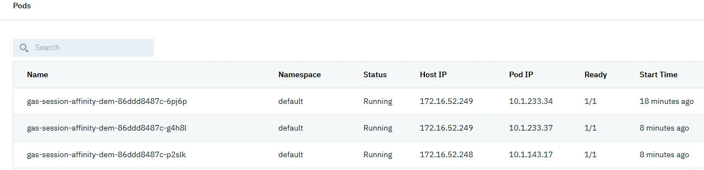
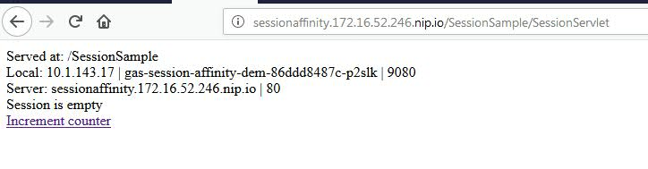
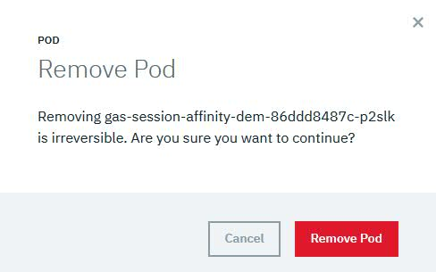
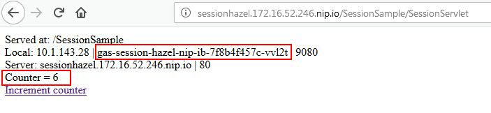
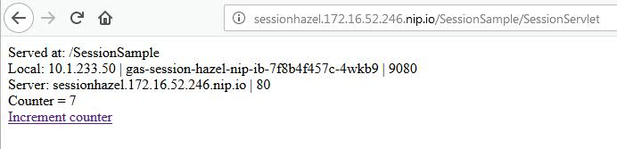

# Session state management considerations

One of the 12 Factor principles is that apps and services should be stateless. 
Many existing monolith applications are heavily relying on HTTP sessions. When you are modernizing your application it is a good practice to rearchitect them to be stateless, but but some times it is not an easy task and you need to postpone it for a while.

There are following methods that you can use in container world to handle session state, depending on your requirements:
- session affinity
- session replication using caching mechanisms
- session persistence using database


## Session affinity

Session affinity is the simplest mechanism for maintaining session state. Using this mechanism, requests from the same session will be routed to the same POD. Selecting this solution, you have to be aware that PODs are not like on-premise servers, they may be restarted much often, in many circumstances.
So this solution might be applicable to applications that need relatively short lived sessions, and can tolerate loosing session data.

### Deploying with session affinity

Session affinity is ustilizing Ingress configuration. You dont have to make any changes in your application code or during building application container, all is done on deployment time.

It is assumed that you already have Docker image uploaded in ICP registry, if not please check *TBD_POINT FILE thatshows how TBD_TO UPLOAD IMAGE*.
You can setup Ingress during application deploymet either via Catalog or using helm.

#### Deploying via Catalog
Go to the Catalog page, and select Liberty chart (either ibm-open-liberty or ibm-websphere-liberty) and click **Configure**.

Specify `Helm release name` and `Target namespace`


Scroll down and expand *All parameters*. Type name of your image from `Liberty image repository` e.g. `mycluster.icp:8500/default/session-sampple` and `Image tag`


Chcek and correct HTTP ports if needed:


Disable SSL setting, if ports are http.

Configure Ingress. **Important - you have to define host name** otherwise affinity will not work. If you dont have that host configured in your DNS, you can use `.nip.io` domain as in our example `http://sessionaffinity.172.16.52.246.nip.io`. 
When using [nip.io](http://nip.io), you can set host to `<sub_domain>.<IP>.nip.io` where `<IP>` would be replaced with the IP address of your cluster’s Ingress controller. 
You can also provide Rewrite target and Path if needed.


For the rest settings accept defaults, scroll down and click **Install** button.

You can check your deployment status on the Deployments page


For now, we have only one pod, so it would be hard to validate if session affinity is working correctly. Lets scale up, to have more pods. Use `Scale` option on your deployment


Now we can see that more pods are running and also check details about the pods.




Lets check the running application, the Ingress we configured, is using `sessionaffinity.172.16.52.246.nip.io` host, where 172.16.52.246 is IP of the proxy node.
To access application type `http://sessionaffinity.172.16.52.246.nip.io/SessionSample/SessionServlet` in the browser. Since this is first request, currenty there is no data in the session. You can also see name of the pod that runs the application.




Make few requests to the app, using the link or reloading the page. You can see the counter value that is taken from the session is increasing, you can also see that requests are routed to the same pod. Session affinity is working.


Go back to the pods page and remove the pod that currently hosts the session



Reload application page. As you can see the request was routed to the differnet pod and session state was lost.


If you want to ensure that session state is not lost when pod is removed, you will need to configure session caching or session persistence.

#### Deploying via helm

You can either provide all requirement parameters via command line, or in `values.yaml` file. values file is recommended as it is more repeatable and less error prone.
You need to override default values for repository, tag, ports, ssl, and ingress configuration. Final file is available here [values-aff.yaml](artifacts/sessions-run/values-aff.yaml).

As prerequisite you need to:
- install ICP cli, kubectl cli, helm cli tools
- configure helm

Once all is done validate helm config issuing:
`helm version --tls`
You should get something similar to:
```
Client: &version.Version{SemVer:"v2.9.1", GitCommit:"20adb27c7c5868466912eebdf6664e7390ebe710", GitTreeState:"clean"}
Server: &version.Version{SemVer:"v2.9.1+icp", GitCommit:"8ddf4db6a545dc609539ad8171400f6869c61d8d", GitTreeState:"clean"}
```

Configure local helm repo issuing:

`helm repo add ibm-charts https://raw.githubusercontent.com/IBM/charts/master/repo/stable/`

Deploy application using:

`helm install -f values-aff.yaml --name gas-session-affinity-helm ibm-charts/ibm-open-liberty --tls`

If deployment is successful you can check it via console and access the application.


### Configure affinity in OpenShift
Session affinity in OpenShift works similar way like in ICP, and seteps are similar. Just instead of `Ingress` object you create have to create `Route`.

To deploy application you will use commandline tool `oc`, but it is also possible to deploy application using OpenShift web console. [Download](https://www.okd.io/download.html) and install `oc` tool. 

Follow these steps to deploy application with session affinity:

Login to OpenShift. OpenShit is using tokens as passwords, you can get token from the web admin console.

`oc login https://ocp-prod.ibm-gse.jkwong.xyz:443 --token=yourToken`

Create new project where application will be deployed, if it does not exist yet.

`oc new-project appmod-session-affinity-guide`

Tag and upload your application Docker image to OpenShift registry. It is assumed that you already have Docker image created, with your application.
Login to OpenShift registry:

`docker login registry.app-ocp-prod.ibm-gse.jkwong.xyz:443`

accept defalult username (openshift) and provide your token as password.

Tag your existing image with registry address and project namespace:

`docker tag session-sample:affinity registry.app-ocp-prod.ibm-gse.jkwong.xyz:443/appmod-session-affinity-guide/session-sample:affinity`

Push image to registry

`docker push registry.app-ocp-prod.ibm-gse.jkwong.xyz:443/appmod-session-affinity-guide/session-sample:affinity`

Create yaml file that will deploy application, service and route or use `oc` tool commands.

`oc new-app -i appmod-session-affinity-guide/session-sample:affinity --name=session-affinity`

Expose the app to the users:

`oc expose svc/session-affinity`

Application will be available under:

`http://session-affinity-appmod-session-affinity-guide.app-ocp-prod.ibm-gse.jkwong.xyz/SessionSample/SessionServlet`


## Session replication using caching mechanisms
Very often session affinity is not enough for application requirements and you need session state to be preserved in case of pod failure. One of the mechanisms that could be used is session caching.  Liberty has feature called `sessionCache-1.0` which provides distributed in-memory HttpSession caching. The `sessionCache-1.0` feature builds on top of an existing technology called [JCache (JSR 107)](https://www.jcp.org/en/jsr/detail?id=107), which offers a standardized distributed in-memory caching API. 

The `sessionCache-1.0` feature does not include a JCache implementation, so you need to pick one and reference it as a `<library>` in your `server.xml`. WebSphere/Open Liberty supports the following JCache implementations:
- Hazelcast
- WebSphere Extreme Scale
- Infinispan
- Ehcache

### Prepare DockerFile with caching configuration
This article shows how to enable [Hazelcast In-Memory Data Grid](https://hazelcast.org/), as it is easily available in many private cloud solutions.
Enabling Hazelcast session caching retrieves the Hazelcast client libraries from the [hazelcast/hazelcast](https://hub.docker.com/r/hazelcast/hazelcast/) Docker image, configures Hazelcast by copying a sample hazelcast.xml, and configures the Liberty server feature sessionCache-1.0 by including the XML snippet hazelcast-sessioncache.xml. By default, the Hazelcast Discovery Plugin for Kubernetes will auto-discover its peers within the same Kubernetes namespace. To enable this functionality, the Docker image author can include the following Dockerfile snippet, and choose from either client-server or embedded topology.

Modify your current Dockerfile with the following lines:

```dockerfile
### Hazelcast Session Caching ###
# Copy the Hazelcast libraries from the Hazelcast Docker image - paths for WebSphere Liberty
COPY --from=hazelcast/hazelcast --chown=1001:0 /opt/hazelcast/lib/*.jar /opt/ibm/wlp/usr/shared/resources/hazelcast/

# Copy the Hazelcast libraries from the Hazelcast Docker image - paths for Open Liberty
# COPY --from=hazelcast/hazelcast --chown=1001:0 /opt/hazelcast/lib/*.jar /opt/ol/wlp/usr/shared/resources/hazelcast/

# Instruct configure.sh to copy the client topology hazelcast.xml
ARG HZ_SESSION_CACHE=client

# Instruct configure.sh to copy the embedded topology hazelcast.xml and set the required system property
#ARG HZ_SESSION_CACHE=embedded
#ENV JAVA_TOOL_OPTIONS="-Dhazelcast.jcache.provider.type=server ${JAVA_TOOL_OPTIONS}"

## This script will add the requested XML snippets and grow image to be fit-for-purpose
RUN configure.sh
```

Build the modified image and push to ICP registry. For more detailed commands refer to **LINK_TO_DEPLOY**

### Deploy Hazelcast in ICP

You need to deploy Hazelcast cluster to your namespece where the application containers will be deployed. You can do that from Catalog or using helm.

Configure local helm repo issuing (if not already configured):

`helm repo add ibm-charts https://raw.githubusercontent.com/IBM/charts/master/repo/stable/`

Invoke following command:

`helm install --name gas-hazel-imdg ibm-charts/ibm-hazelcast-dev --tls --set replicaCount=2`

The `replicaCount` setting configures number of pods for your Hazelcast cluster. For failover you shoud have at least 2.
You can verify deployed chart via console or command line.

```
$kubectl get pods | grep haze
gas-hazel-imdg-hazelcast-imdg-0                                1/1     Running     0          5m14s
gas-hazel-imdg-hazelcast-imdg-1                                1/1     Running     0          4m38s
```

#### Deploy and test application with session caching

Once you have Hazelcast cluster deployed, you can install your application. Application itself is deployed exactly the same way as in section describing session affinity. Please follow thoses steps with small changes:
- point to new image, it may differ by name or tag
- provide differnet host in the Ingress configuration, for this testing `sessionhazel.172.16.52.246.nip.io` was used.

To test the application and session replication, open the browser and make several requests to it. Notice current pod that is handling requests.



Now kill the pod that handle requests.
And refresh the browser. As you can see request is served by different pod, but session state was maintained.



You can make additional resiliency test, for example, killing one of the Hazelcast cluster pods and verifing that session state is still correctly maintained.


### Deploy Hazelcast in OpenShift
Hazelcast can be used also in OpenShift. By default it requires paid version - Hazelcast Enterprise. But you can use also free version [Hazelcast OpenShift Origin](https://github.com/hazelcast/hazelcast-code-samples/blob/master/hazelcast-integration/openshift/hazelcast-cluster/hazelcast-openshift-origin). See details on this page [Hazelcast for OpenShift](https://github.com/hazelcast/hazelcast-code-samples/tree/master/hazelcast-integration/openshift)

For this article you will use Hazelcast OpenShift Origin.

#### Deploy Hazelcast cluster
Easiest way to deploy Hazelcast is to use following file [hazelcast.yaml](https://github.com/hazelcast/hazelcast-code-samples/blob/master/hazelcast-integration/openshift/hazelcast-cluster/hazelcast-openshift-origin/hazelcast.yaml)

Create project for Hazelcast cluster

`$ oc new-project appmod-hazelcast`

Deploy Hazelcast cluster

`$ oc new-app -f hazelcast.yaml -p NAMESPACE=appmod-hazelcast`

Check the status of deployed cluster

```
$ oc get all
NAME              READY     STATUS              RESTARTS   AGE
pod/hazelcast-0   1/1       Running             0          1m
pod/hazelcast-1   1/1       Running             0          42s
pod/hazelcast-2   0/1       ContainerCreating   0          2s

NAME                        TYPE           CLUSTER-IP        EXTERNAL-IP                     PORT(S)          AGE
service/hazelcast-service   LoadBalancer   x.x.x.x             y.y.y.y                       5701:32567/TCP   1m

NAME                         DESIRED   CURRENT   AGE
statefulset.apps/hazelcast   3         3         1m
```

This cluster contains 3 replicas, look in one of the pods logs to check if all members are correctly detected. Look for similar messages:


```
$ oc get pods

Members {size:3, ver:7} [
	Member [192.168.16.15]:5701 - 9dc4af56-6df8-4a65-9890-68bf99e0ea5a
	Member [192.168.12.16]:5701 - f927d37c-860d-4b38-88b4-b1f3dd97bfd1 this
	Member [192.168.22.15]:5701 - ec8602a7-59b0-4dab-8446-3a8f32dac845
]
```

#### Deploy OpenLiberty configured for Hazelcast
Hazelcast client configured with OpenLiberty is using Kubernetes API to find Hazelcast cluster. 

Create project for the client application

`$ oc new-project appmod-hazelcast-liberty`

Using Kubernetes API requires granting certain permissions. You may need to create new service account if you dont want to change privilidges for the default.

`$ oc create serviceaccount hazelcast-liberty -n appmod-hazelcast-liberty` 

Create rbac.yaml with the following content

```yaml
apiVersion: rbac.authorization.k8s.io/v1
kind: ClusterRoleBinding
metadata:
  name: default-cluster
roleRef:
  apiGroup: rbac.authorization.k8s.io
  kind: ClusterRole
  name: view
subjects:
- kind: ServiceAccount
  name: hazelcast-liberty
  namespace: appmod-hazelcast-liberty

```

Then, apply `rbac.yaml`.

```bash
$ kubectl apply -f rbac.yaml
```

*Note*: You can be even more strict with the permissions and create your own Role. For details, please check the implementation of [Hazelcast Helm Chart](https://github.com/helm/charts/tree/master/stable/hazelcast).

You need to change service account that will run the container, so generate the yaml file that could be used for further customization and deployment. The `KUBERNETES_NAMESPACE` environment variable requied by Hazelcast Kubernetes plugin is already included in the command

`$ oc new-app -i session-sample:hazel -e KUBERNETES_NAMESPACE=appmod-hazelcast -o yaml > session-hazel-deploy.yaml`

The output will be similar to

```
apiVersion: v1
items:
- apiVersion: apps.openshift.io/v1
  kind: DeploymentConfig
  metadata:
    annotations:
      openshift.io/generated-by: OpenShiftNewApp
    creationTimestamp: null
    labels:
      app: session-sample
    name: session-sample
  spec:
    replicas: 1
    selector:
      app: session-sample
      deploymentconfig: session-sample
    strategy:
      resources: {}
    template:
      metadata:
        annotations:
          openshift.io/generated-by: OpenShiftNewApp
        creationTimestamp: null
        labels:
          app: session-sample
          deploymentconfig: session-sample
      spec:
        containers:
        - env:
          - name: KUBERNETES_NAMESPACE
            value: appmod-hazelcast
          image: docker-registry.default.svc:5000/appmod-hazelcast-liberty/session-sample:hazel
          name: session-sample
          ports:
          - containerPort: 9443
            protocol: TCP
          - containerPort: 9080
            protocol: TCP
          resources: {}
    test: false
    triggers:
    - type: ConfigChange
    - imageChangeParams:
        automatic: true
        containerNames:
        - session-sample
        from:
          kind: ImageStreamTag
          name: session-sample:hazel
          namespace: appmod-hazelcast-liberty
      type: ImageChange
  status:
    availableReplicas: 0
    latestVersion: 0
    observedGeneration: 0
    replicas: 0
    unavailableReplicas: 0
    updatedReplicas: 0
- apiVersion: v1
  kind: Service
  metadata:
    annotations:
      openshift.io/generated-by: OpenShiftNewApp
    creationTimestamp: null
    labels:
      app: session-sample
    name: session-sample
  spec:
    ports:
    - name: 9080-tcp
      port: 9080
      protocol: TCP
      targetPort: 9080
    - name: 9443-tcp
      port: 9443
      protocol: TCP
      targetPort: 9443
    selector:
      app: session-sample
      deploymentconfig: session-sample
  status:
    loadBalancer: {}
kind: List
metadata: {}

```

Modify it with service account and security details. Add the following to the `template/spec` section:

```
     serviceAccountName: hazelcast-liberty
     serviceAccount: hazelcast-liberty
```

Deploy application:

```bash
$ oc create -f session-hazel-deploy.yaml
```

Expose service:
```bash
$ oc expose service/session-sample
```


## Session persistnece using database

In some cases you may want to use database instead of cache for storing session data, especailly if you earlier already were using database as session persistent layer.

Liberty fully supports session persistence using data base using `sessionDatabase-1.0` feature.
You will utilize dynamic configuration support in Liberty to configure session persistence without modifying your original server configuration.

### Liberty configuration

Create new configuration file `session-db.xml` with the following contents. It configures required feature, database driver libraries, datasource, and http session management.

```xml
<server description="Demonstrates HTTP Session Persistence Configuration">
  <featureManager>
          <feature>sessionDatabase-1.0</feature>
  </featureManager>

  <library id="DB2Lib">
    <fileset dir="${server.config.dir}/resources/db2" includes="*.jar"/>
  </library>

  <dataSource id="SessionsDS">
    <jdbcDriver libraryRef="DB2Lib"/>
    <properties.db2.jcc databaseName="${env.DB2_DBNAME}" password="${env.DB2_PASSWORD}" portNumber="${env.DB2_PORT}" serverName="${env.DB2_HOST}" user="${env.DB2_USER}"/>
    <connectionManager agedTimeout="0" connectionTimeout="180" maxIdleTime="1800" maxPoolSize="10" minPoolSize="1" reapTime="180"/>
  </dataSource>

  <httpSessionDatabase id="SessionDB" dataSourceRef="SessionsDS"/>
  <httpSession cloneId="${env.HOSTNAME}"/>

</server>

```

In the configuration you are utilizing environment variables for database access parameters such as host, port, userid, etc (e.g. `${env.DB2_HOST}`). These variables will be provided during the deploment.

### Modifying Dockerfile

As now solution requires additional configuration file and database driver to access session database, that needs to be added to the dockerfile.

```
# session persistence
COPY --chown=1001:0 db2drivers/ /config/resources/db2
COPY --chown=1001:0 src/main/liberty/config/session-db.xml /config/configDropins/overrides/
```

Then build and push your docker image as usuall.
Once your image is built you can deploy it to the container platform.

### Deploying to OpenShift

Prepare script that will deploy application and set the required environment propertes `app-deploy.yaml`:

```yaml
apiVersion: v1
items:
- apiVersion: apps.openshift.io/v1
  kind: DeploymentConfig
  metadata:
    labels:
      app: session-jdbc
    name: session-jdbc
  spec:
    replicas: 1
    selector:
      app: session-jdbc
      deploymentconfig: session-jdbc
    strategy:
      resources: {}
    template:
      metadata:
        labels:
          app: session-jdbc
          deploymentconfig: session-jdbc
      spec:
        containers:
        - env:
            - name: DB2_HOST
              value: db2.db2.svc
            - name: DB2_PORT
              value: '50000'
            - name: DB2_DBNAME
              value: INDB
            - name: DB2_USER
              value: db2inst1
            - name: DB2_PASSWORD
              value: db2inst1
          image: docker-registry.default.svc:5000/appmod-session-jdbc/session-sample:jdbc
          name: session-sample
          ports:
          - containerPort: 9443
            protocol: TCP
          - containerPort: 9080
            protocol: TCP
          resources: {}
    test: false
    triggers:
    - type: ConfigChange
- apiVersion: v1
  kind: Service
  metadata:
    labels:
      app: session-jdbc
    name: session-jdbc
  spec:
    ports:
    - name: 9080-tcp
      port: 9080
      protocol: TCP
      targetPort: 9080
    - name: 9443-tcp
      port: 9443
      protocol: TCP
      targetPort: 9443
    selector:
      app: session-jdbc
      deploymentconfig: session-jdbc
  status:
    loadBalancer: {}
kind: List
metadata: {}
```

Deploy application:

```bash
$ oc create -f app-deploy.yaml
```

Expose service:
```bash
$ oc expose service/session-jdbc
```

### Deploying to ICP
TBD


