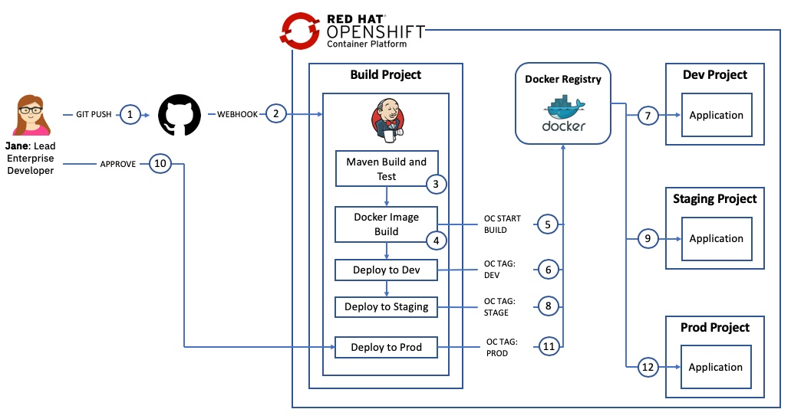
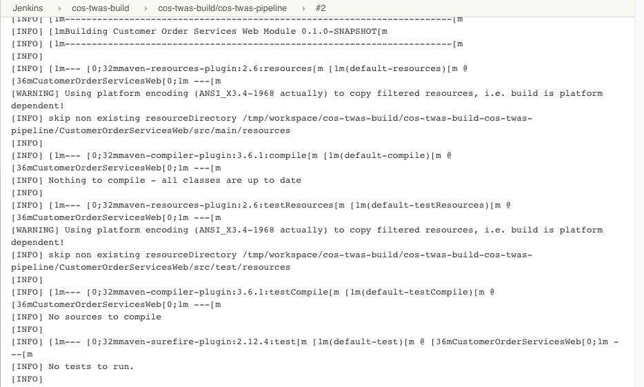
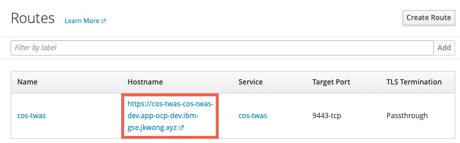
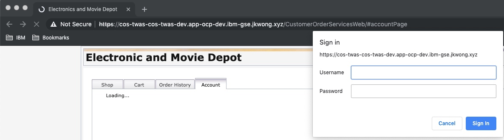

# Introduction
This section covers how to deploy the application to RedHat OpenShift using an automated CI/CD pipeline. The diagram below shows the flow of the pipeline which starts when the developer checks their code in to Git and ends with the application being deployed in Production.



1. the developer checks their code in to `git`
2. a `webhook` automatically triggers the Jenkins Pipeline in the RHOS cluster
3. the pipeline checks out the code from `git` and uses `maven` to build and test the application
4. the `oc start build` command is used to build a `docker` image for the application
5. the image is added to the `ImageStream` and pushed to the `docker registry` in the RHOS cluster
6. the image is then `tagged` for the `dev` project
7. the `deployment` running in the `dev` project is restarted using the newly created image
8. the image is then `tagged` for the `stage` project
9. the `deployment` running in the `stage` project is restarted using the newly created image
10. the developer is prompted to `approve` the deployment to production
11. the image is then `tagged` for the `prod` project
12. the `deployment` running in the `prod` project is restarted using the newly created image

The final versions of the files created in this section can be found in the `was90` branch of [this repo](https://github.com/ibm-cloud-architecture/cloudpak-for-applications/tree/was90)

## Summary
This section has the following steps:

1. RedHat OpenShift terminology and constructs
2. The `Jenkinsfile` for the pipeline
3. Create the `Security Context Constraint` required for WebSphere to run on RedHat OpenShift
4. Create the `build`, `dev`, `stage` and `prod` projects
5. Create a new `Service Account` and bind it to the `Security Context Constraint` in the `dev`, `stage` and `prod` projects
6. Deploy Jenkins in the `build` namespace
7. Grant the `jenkins` service account `edit` privileges in the `dev`, `stage` and `prod` projects
8. Import the `deployment template` in to the `dev`, `stage` and `prod` projects
9. Create the `deployment config`, `service` and `route` definitions using the template in the `dev`, `stage` and `prod` projects
10. Import the `build template` in to the `build` project
11. Create the `ImageStream` and `BuildConfig` definitions in the `build` project
12. Trigger the pipeline and validate the application is running

## RedHat OpenShift constructs
It is assumed that the reader is familiar with the following basic constructs provided by Kubernetes:

- [Pod](https://kubernetes.io/docs/concepts/workloads/pods/pod-overview/)
- [Deployment](https://kubernetes.io/docs/concepts/workloads/controllers/deployment/)
- [ServiceAccount](https://kubernetes.io/docs/tasks/configure-pod-container/configure-service-account/)
- [Service](https://kubernetes.io/docs/concepts/services-networking/service/)

RedHat OpenShift has the following constructs that are used in this scenario:
- [Route](https://docs.openshift.com/container-platform/3.11/architecture/networking/routes.html)
- [ImageStream](https://docs.openshift.com/container-platform/3.11/dev_guide/managing_images.html)
- [BuildConfig](https://docs.openshift.com/container-platform/3.11/dev_guide/builds/build_strategies.html)
- [DeploymentConfig](https://docs.openshift.com/container-platform/3.11/architecture/core_concepts/deployments.html#deployments-and-deployment-configurations)
- [SecurityContextConstraints](https://docs.openshift.com/container-platform/3.11/admin_guide/manage_scc.html#add-scc-to-user-group-project)
- [Application](https://docs.openshift.com/container-platform/3.11/dev_guide/application_lifecycle/new_app.html)
- [Template](https://docs.openshift.com/container-platform/3.11/dev_guide/templates.html)

## The Jenkinsfile for the pipeline
A [`Jenkinsfile`](https://jenkins.io/doc/book/pipeline/jenkinsfile/) contains the definition of a pipeline in a format that can be stored in source control.

In addition to standard Jenkins Pipeline Syntax, the OpenShift provides a Domain Specific Language (DSL) through the OpenShift Jenkins Client Plug-in. OpenShift DSL is easily readable that interacts with OpenShift API server, giving more control over the build, deployment, and promotion of applications on OpenShift cluster.

The `Jenkinsfile` for this application can be found [here](https://github.com/ibm-cloud-architecture/cloudpak-for-applications/blob/was90/Jenkinsfile)

The Jenkinsfile has the following `stages`:

1. `preamble`: outputs some variable valus to the console
2. `Maven Build`: builds the application EAR file using `maven`
3. `Unit Test`: tests the application using `maven`
4. `Build twas App Image`: uses the `BuildConfig` to build the Docker Image using the provided `Dockerfile`. This automatically tags the image in the `build` Project's `ImageStream`
5. `Promote to Dev`: `tags` the image to the `dev` Project's `ImageStream` which results in the `deployment` in the `dev` Project being restarted with the new image
6. `Promote to Stage`: `tags` the image to the `stage` Project's `ImageStream` which results in the `deployment` in the `stage` Project being restarted with the new image  
7. `Promotion gate`: prompts the user to approve promotion to production
8. `Promote to Prod`: the image to the `prod` Project's `ImageStream` which results in the `deployment` in the `prod` Project being restarted with the new image  


## Create the Security Context Constraint
In order to deploy and run the WebSphere Base Docker image in an OpenShift cluster, we first need to configure certain security aspects for the cluster. The `Security Context Constraint` provided [here](https://github.com/ibm-cloud-architecture/cloudpak-for-applications/blob/was90/Deployment/OpenShift/ssc.yaml) grants the [service account](https://kubernetes.io/docs/tasks/configure-pod-container/configure-service-account/) that the WebSphere Base Docker container is running under the required privileges to function correctly.

A **cluster administrator** can use the file provided [here](https://github.com/ibm-cloud-architecture/cloudpak-for-applications/blob/was90/Deployment/OpenShift/ssc.yaml) with the following command to create the Security Context Constraint (SCC):

```
oc apply -f ssc.yaml
```

## Create the projects
Four RedHat OpenShift projects are required in this scenario:
- Build: this project will contain the Jenkins server and the artifacts used to build the application image  
- Dev: this is the `development` environment for this application
- Stage: this is the `staging` environment for this application
- Prod: this is the `production` environment for this application

The file provided [here](https://github.com/ibm-cloud-architecture/cloudpak-for-applications/blob/was90/Deployment/OpenShift/twas-projects.yaml) contains the definitions for the four projects in a single file to make creation easier

Issue the command shown below to create the projects
```
oc create -f twas-projects.yaml
```

## Create a service account
It is a good Kubernetes practice to create a [service account](https://kubernetes.io/docs/tasks/configure-pod-container/configure-service-account/) for your applications. A service account provides an identity for processes that run in a Pod. In this step we will create a new service account with the name `websphere` in each of the `dev`, `stage` and `prod` projects and add the Security Context Constraint created above to them.

Issue the commands shown below to create the `websphere` service account and bind the ibm-websphere-scc to it in each of the projects:
```
oc create serviceaccount websphere -n cos-twas-dev
oc create serviceaccount websphere -n cos-twas-stage
oc create serviceaccount websphere -n cos-twas-prod
oc adm policy add-scc-to-user ibm-websphere-scc -z websphere -n cos-twas-dev
oc adm policy add-scc-to-user ibm-websphere-scc -z websphere -n cos-twas-stage
oc adm policy add-scc-to-user ibm-websphere-scc -z websphere -n cos-twas-prod
```

## Deploy Jenkins
Some RedHat OpenShift clusters are configured to automatically provision a Jenkins instance in a build project. The steps below can be used if your cluster is not configured for automatic Jenkins provisioning:

```
oc project cos-twas-build
oc new-app jenkins-persistent
```

## Update the Jenkins service account
During provisioning of the Jenkins master a service account with the name `jenkins` is created. This service account has privileges to create new artifacts only in the project that it is running in. In this scenario Jenkins will need to create artifacts in the `dev`, `stage` and `prod` projects.

Issue the commands below to allow the `jenkins` service account to `edit` artifacts in the `dev`, `stage` and `prod` projects.

```
oc policy add-role-to-user edit system:serviceaccount:cos-twas-build:jenkins -n cos-twas-dev
oc policy add-role-to-user edit system:serviceaccount:cos-twas-build:jenkins -n cos-twas-stage
oc policy add-role-to-user edit system:serviceaccount:cos-twas-build:jenkins -n cos-twas-prod
```

## Import the deployment templates
RedHat OpenShift [templates](https://docs.openshift.com/container-platform/3.11/dev_guide/templates.html) are used to make artifact creation easier and repeatable. The template definition provided [here](https://github.com/ibm-cloud-architecture/cloudpak-for-applications/blob/was90/Deployment/OpenShift/template-twas-deploy.yaml) defines a Kubernetes [`Service`](https://kubernetes.io/docs/concepts/services-networking/service/), [`Route`](https://docs.openshift.com/container-platform/3.11/architecture/networking/routes.html) and [`DeploymentConfig`](https://docs.openshift.com/container-platform/3.11/architecture/core_concepts/deployments.html#deployments-and-deployment-configurations) for the CustomerOrderServices application.

The `gse-twas-deploy` template defines the following:
- `service` listening on ports `9080`, `9443` and `9082`
- `route` to expose the `9443` port externally
- `DeploymentConfig` to host the WebSphere Base container.
  - The `image` for the container is taken from the [`ImageStream`](https://docs.openshift.com/container-platform/3.11/dev_guide/managing_images.html) that will be populated by the Jenkins pipeline.
  - `environment variables` are defined for the DB2 database used by the application allowing for environment specific information to be injected
  - [Probes](https://kubernetes.io/docs/tasks/configure-pod-container/configure-liveness-readiness-probes/) for `liveness` and `readiness` are defined to check port 9443 is active
  - The `securityContext` is set to allow read/write access to the filesystem and to run the container as `user 1001`
  - The deployment will be updated if a new image is loaded to the `ImageStream` or if a change to the configuration is detected.

Issue the commands below to load the template named `gse-twas-deploy` in the `dev`, `stage` and `prod` projects.

```
oc create -f template-twas-deploy.yaml -n cos-twas-dev
oc create -f template-twas-deploy.yaml -n cos-twas-stage
oc create -f template-twas-deploy.yaml -n cos-twas-prod
```

## Create the deployment definitions
In this step the `gse-twas-deploy` template will be used to create a RedHat OpenShift [application](https://docs.openshift.com/container-platform/3.11/dev_guide/application_lifecycle/new_app.html) named `cos-twas` in the `dev`, `stage` and `prod` namespaces.

The result will be:
- `service` listening on ports `9080`, `9443` and `9082`
- `route` to expose the `9443` port externally
- `DeploymentConfig` to host the WebSphere Base container. The deployment config will wait for a `docker image` to be loaded in to the `ImageStream` by the Jenkins pipeline.

Issue the following commands to create the applications from the template:

```
oc new-app gse-twas-deploy -p APPLICATION_NAME=cos-twas -n cos-twas-dev
oc new-app gse-twas-deploy -p APPLICATION_NAME=cos-twas -n cos-twas-stage
oc new-app gse-twas-deploy -p APPLICATION_NAME=cos-twas -n cos-twas-prod
```

## Import the build templates
In this step a template for the `build` process will be loaded in to the `build` project. The template provided [here](https://github.com/ibm-cloud-architecture/cloudpak-for-applications/blob/was90/Deployment/OpenShift/template-twas-build.yaml) defines the following artifacts:

- An [ImageStream](https://docs.openshift.com/container-platform/3.11/dev_guide/managing_images.html) for the application image. This will be populated by the Jenkins Pipeline
- An ImageStream for WebSphere Base which will pull down the latest version of the `ibmcom/websphere-traditional:latest-ubi` image and will monitor DockerHub for any updates.
- A `binary` [BuildConfig](https://docs.openshift.com/container-platform/3.11/dev_guide/builds/build_strategies.html) that will be used by the Jenkins Pipeline to build the application Docker image
- A `jenkinsfile` BuildConfig that defines the `Pipeline` using the `Jenkinsfile` in GitHub
- Parameters to allow the WebSphere Base image and GitHub repository to be provided when the template is instantiated

Issue the commands below to load the template named `gse-twas-build` in the `build` projects.

```
oc create -f template-twas-build.yaml -n cos-twas-build
```

## Create the build definitions
In this step the `gse-twas-build` template will be used to create a RedHat OpenShift [application](https://docs.openshift.com/container-platform/3.11/dev_guide/application_lifecycle/new_app.html) named `cos-twas` in the `build` namespaces.

The result will be:
- An [ImageStream](https://docs.openshift.com/container-platform/3.11/dev_guide/managing_images.html) for the application image. This will be populated by the Jenkins Pipeline
- An ImageStream for WebSphere Base which will pull down the latest version of the `ibmcom/websphere-traditional:latest-ubi` image and will monitor DockerHub for any updates.
- A `binary` [BuildConfig](https://docs.openshift.com/container-platform/3.11/dev_guide/builds/build_strategies.html) that will be used by the Jenkins Pipeline to build the application Docker image
- A `jenkinsfile` BuildConfig that defines the `Pipeline` using the `Jenkinsfile` in GitHub (with the URL provided as a parameter when the application is created)

Issue the following commands to create the application from the template:

```
oc new-app gse-twas-build -p APPLICATION_NAME=cos-twas -p SOURCE_URL="https://github.com/ibm-cloud-architecture/cloudpak-for-applications" -n cos-twas-build
```

## Run the pipeline  
The newly created pipeline can be started from the RedHat OpenShift console which allows access to the Jenkins logs but also tracks the progress in the OCP console.

1. Navigate to **Application Console --> Customer Order Services on twas - Build --> Builds --> Pipelines** and click the **Start Pipeline** button

  

2. When the pipeline starts, click the `view log` link to go to the Jenkins administration console. Note that it may take a couple of minutes before the `view log` link appears on the first pipeline build

  

3. When prompted, log in with your OpenShift account and grant the required access permissions. The Jenkins console log will be displayed as shown below:

  

4. Return to the OpenShift Console and track the progress of the pipeline

  

5. The pipeline will eventually stop at the **Promotion Gate** for approval to deploy to Production. Click the **Input Required** link as shown below

  

6. When the *Promote application to Production* question is displayed, click **Proceed**

  

7. Return to the OpenShift Console and validate that the pipeline is now complete

  

## Validate the Deployments
Now that the pipeline is complete, validate the Customer Order Services application is deployed and running in `dev`, `stage` and `prod`

1. In the OpenShift Console, navigate to **Application Console --> Customer Order Services on twas - Dev --> Applications --> Deployments** and click on the link in the **Latest Version** column

  

2. Information about the deployment will be displayed including the **image** that is being used (note the **tag** on the image as it will be the same in the `stage` and `prod` deployments). After a few minutes the container will be marked as **ready**

  

3. Click **Applications --> Routes** and click on the **route** for the application. Note that the URL is < application_name >-< project_name >.< ocp cluster url >. In this case the project name is `cos-twas-dev`

  

4. Add `/CustomerOrderServicesWeb` to the end of the URL in the browser to access the application

  

5. Repeat the validations for the `stage` and `prod` Projects.

## Review and Next Steps
In this section you configured a CI/CD pipeline for the CustomerOrderServices application that builds a single immutable image for the latest version of the application and then deploys it to three different environments.
